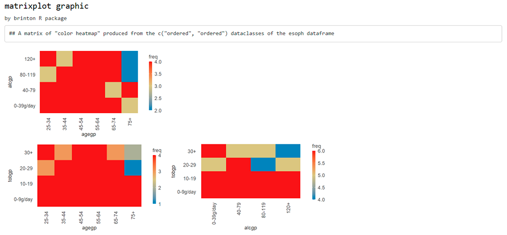

<!-- README.md is generated from README.Rmd. Please edit that file -->

```{r setup, include = FALSE}
knitr::opts_chunk$set(
  collapse = TRUE,
  comment = "#>",
  fig.path = "man/figures/",
  out.width = "100%"
)
```

# brinton 

This package introduces:

+ `wideplot()` graphics for exploring the structure of a dataset through a grid of variables and graphic types. 
+ `longplot()` graphics, which present the entire catalog of available graphics for representing one particular variable or a limited selection of variables using a grid of graphic types and variations on these types. 
+ `matrixplot()` graphics, a generalization of a pairs plot in the sense that the graphic that is replicated in each cell of the matrix can be selected from the catalogue of bivariate graphics. 
+ `plotup()` function, which complements the previous three functions in that it presents a particular graphic for a specific variable or a limited number of variables of a dataset.

Future work will include the ability to draw `longplot()` and `plotup()` graphics from a selection of a wider number and combinations of types of variables within a dataset.

## Installation

You can install the released version of brinton from [CRAN](https://CRAN.R-project.org) with:

```{r installation, eval = FALSE}
install.packages("brinton")
```

And then load the functions included in the package:
```{r load}
library(brinton)
```


## Example

When a new dataset comes up, R users use to call the `str()` function that describes textually the main characteristics of this dataset. The new `wideplot()` function does the same but graphically. As an example, just run:

```{r wideplot, eval = FALSE}
wideplot(esoph)
```

```{r readme01, echo=FALSE, eval=TRUE, out.width = "100%"}
knitr::include_graphics("man/figures/readme_01ss.png")
```

This function includes the argument `dataclass` that sets the types of variables to be included in the grid as well as the order in which they are listed. As an example, the following line will plot only the numeric variables included in the iris dataset:
```{r wideplot2, eval = FALSE}
wideplot(esoph, dataclass = c("numeric"))
```

```{r readme02, echo=FALSE, eval=TRUE, out.width = "100%"}
knitr::include_graphics("man/figures/readme_02ss.png")
```

Although, the `wideplot()` function shows only a small set of the graphics suitable for each type of data. If the user wants to see all the available graphics for some specific variable or a combination of two specific variables  included in the dataset, then the `longplot()` is useful. As an example, just run:
```{r longplot, eval = FALSE}
longplot(esoph, "alcgp")
```

```{r readme03, echo=FALSE, eval=TRUE, out.width = "100%"}
knitr::include_graphics("man/figures/readme_03ss.png")
```

```{r longplot2, eval = FALSE}
longplot(esoph, c("alcgp", "agegp"))
```

```{r readme04, echo=FALSE, eval=TRUE, out.width = "100%"}
knitr::include_graphics("man/figures/readme_04ss.png")
```

Any of the graphics presented in the `longplot()` output can also be included as an output of the `wideplot()` function. If one wants to compare the output of some other specific graphics one can, for instance, run:
```{r wideplot3, eval = FALSE}
wideplot(
  esoph,
  dataclass = c("numeric"),
  numeric = c("point graph", "binned heatmap", "bw binned heatmap", "color binned heatmap"),
  label = TRUE
)
```

```{r readme05, echo=FALSE, eval=TRUE, out.width = "100%"}
knitr::include_graphics("man/figures/readme_05ss.png")
```

Sometimes, specially with character variables, there is not enought space for the graphic area, and the user may want to increase the width of the columns in the matrix. The user can then modify the defalut value of the `ncol` argument:
```{r wideplot4, eval = FALSE}
wideplot(
  esoph,
  dataclass = c("numeric"),
  numeric = c("point graph", "binned heatmap", "bw binned heatmap", "color binned heatmap"),
  label = TRUE,
  ncol = 4
)
```

```{r readme06, echo=FALSE, eval=TRUE, out.width = "100%"}
knitr::include_graphics("man/figures/readme_06ss.png")
```

While the wideplot function displays a grid of univariate graphics, if a matrix of bivariate graphics is intended for variables of one particular type, the matrixplot() function is useful. Type for instance the following code:
```{r matrixplot1, eval = FALSE}
matrixplot(esoph, dataclass = "ordered", diagram = "color heatmap")
```

```{r readme07, echo=FALSE, eval=TRUE, out.width = "100%"}

```

Same thing if the desired matrix has to include graphics from variables of two different types (please note that the graphic type has to be compatible):
```{r matrixplot2, eval = FALSE}
matrixplot(esoph, dataclass = c("numeric", "ordered"), diagram = "box plot")
```

```{r readme08, echo=FALSE, eval=TRUE, out.width = "100%"}
knitr::include_graphics("man/figures/readme_08ss.png")
```

If the user is interested in one particular graphic then the function `plotup()` is useful. 
```{r plotup1, out.width = '40%'}
plotup(esoph, "ncases", "color histogram")
```

Or, as an example of a graphic that requires more than one input variable:
```{r plotup2, out.width = '40%', warning=FALSE, out.width = "40%"}
plotup(esoph, c("agegp", "alcgp"), "color stacked bar graph")
```

The default output of the `plotup()` function is a `c("gg", "ggplot")` object but the `output` argument allows, as a side effect, to write and present the graphic in a html file or to print the ggplot2 function in the console:
```{r plotspane1, eval = FALSE}
plotup(esoph, c("agegp", "alcgp"), "color stacked bar graph", output = "html")
```

```{r readme09, echo=FALSE, eval=TRUE, out.width = "100%"}
knitr::include_graphics("man/figures/readme_09ss.png")
```

```{r console}
plotup(esoph, c("agegp", "alcgp"), "color stacked bar graph", output = "console")
```


