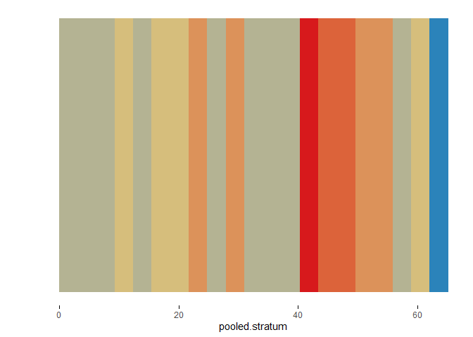

<!-- README.md is generated from README.Rmd. Please edit that file -->

# brinton 

This package introduces:

  - `wideplot()` graphics for exploring the structure of a dataset
    through a grid of variables and graphic types.
  - `longplot()` graphics, which present the entire catalog of available
    graphics for representing a particular variable using a grid of
    graphic types and variations on these types.
  - `plotup()` function, which complements the previous two functions in
    that it presents a particular graphic for a specific variable of a
    dataset.

Future work will include the hability to draw `longplot()` and
`plotup()` from a selection of a limited number of variables within a
dataset.

## Installation

You can install the released version of brinton from
[CRAN](https://CRAN.R-project.org) with:

``` r
install.packages("brinton")
```

And then load the functions included in the package:

``` r
library(brinton)
#> Loading required package: ggplot2
#> Loading required package: gridExtra
#> Loading required package: rmarkdown
#> Loading required package: glue
#> M a G i C i N G R a P H S
```

## Example

When a new dataset comes up, R users use to call the `str()` function
that describes textually the main characteristics of this dataset. The
new `wideplot()` function does the same but graphically. As an example,
just run:

``` r
wideplot(infert)
```

This function includes the argument `dataclass` that sets the types of
variables to be included in the grid as well as the order in which they
are listed. As an example, the following line will plot only the numeric
variables included in the iris dataset:

``` r
wideplot(infert, dataclass = c("numeric"))
```

Although, the `wideplot()` function shows only a small set of the
graphics suitable for each type of data. If the user wants to see all
the available graphics for some specific variable included in the
dataset, then the `longplot()` is useful. As an example, just run:

``` r
longplot(infert, "pooled.stratum")
```

Any of the graphics presented in the `longplot()` output can also be
presented. If one wants to compare the output of some other specific
graphics one can, for instance, run:

``` r
wideplot(infert,
         dataclass = c("numeric"),
         numeric = c("point graph", "binned point graph", "binned heatmap"),
         label = TRUE)
```

Sometimes, specially with character variables, there is not enought
space for the graphic area, and the user may want to increase the width
of the columns in the matrix. The user can then modify the defalut value
of the `ncol` argument:

``` r
wideplot(infert,
         dataclass = c("numeric"),
         numeric = c("point graph", "binned point graph", "binned heatmap"),
         label = TRUE,
         ncol = 3)
```

If the user is interested in one particular graphic, then the function
`plotup()` is useful.

``` r
plotup(infert, "pooled.stratum", "color binned stripe graph")
```

The default output is still a html file but, the `plotup()` function
allows also to plot the graphic in the plots pane or the console:

``` r
plotup(infert, "pooled.stratum", "color binned stripe graph", output = "plots pane")
```



``` r
plotup(infert, "pooled.stratum", "color binned stripe graph", output = "console")
#> theme_set(theme_minimal())
#> 
#> binwidth <- (max(infert['pooled.stratum'], na.rm=TRUE)-min(infert['pooled.stratum'], na.rm=TRUE))/20
#> ggplot(infert, aes(x=pooled.stratum)) +
#>   geom_bin2d(aes(y=1), binwidth = c(binwidth, 1)) +
#>   scale_fill_gradientn(colours = colorRampPalette(rev(RColorBrewer::brewer.pal(4, 'Spectral')))(3)) +
#>   theme(panel.grid = element_line(colour = NA),
#>     axis.text.y =element_text(color = NA),
#>     axis.title.y =element_text(color = NA),
#>     axis.ticks.x =element_line(color = 'black'),
#>     legend.position='none')
```
