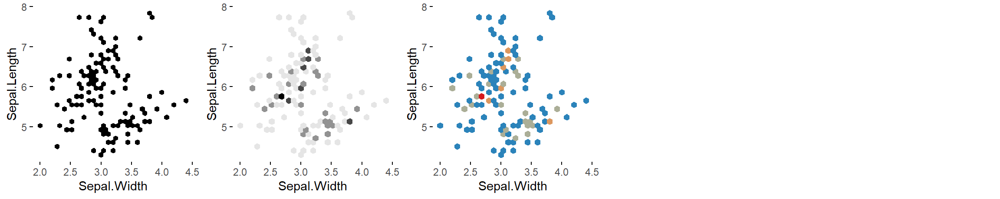
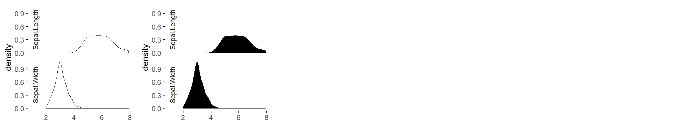
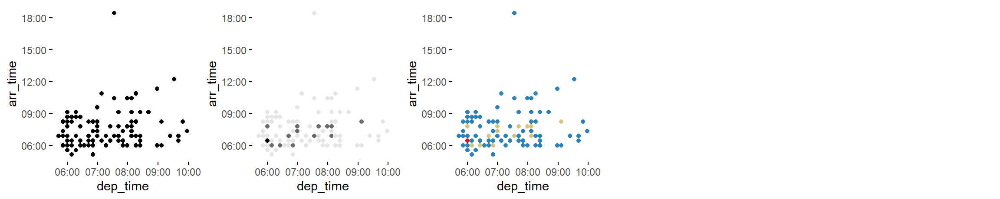
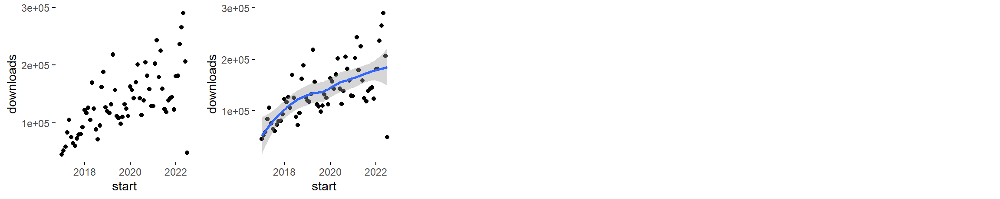
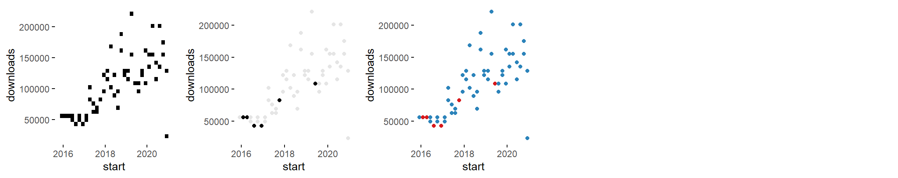
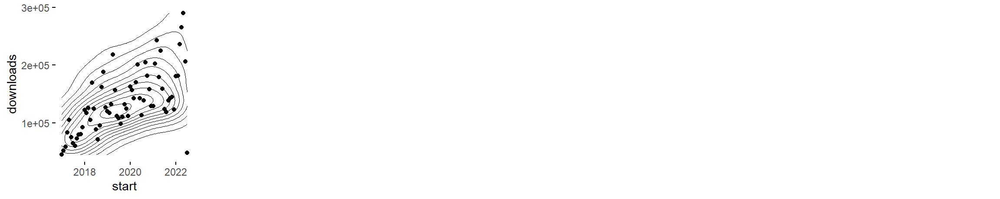
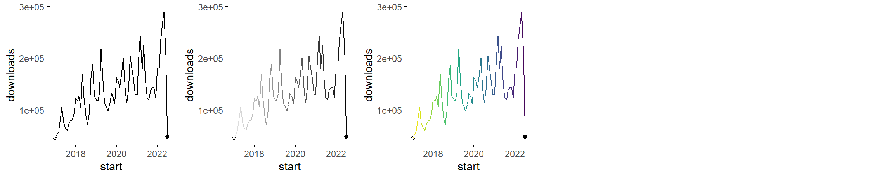
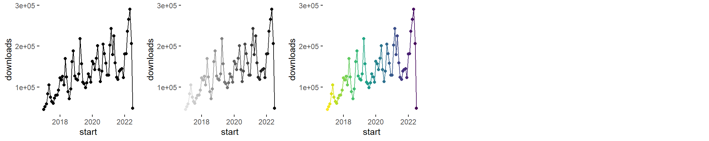
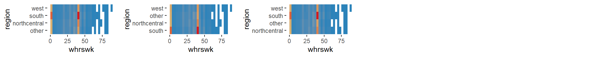

<style>
  .main-container {
  max-width: 1200px !important;
  }
  h1.title {
  font-family: Helvetica, Arial, sans-serif;
  font-size: 20px;
  color: #4d4d4d;
  margin-top: 100px;
  }
  h1 {
  font-family: Helvetica, Arial, sans-serif;
  font-size: 20px;
  color: 4d4d4d;
  margin-top: 35px;
  }
  h2 {
  font-family: Helvetica, Arial, sans-serif;
  font-size: 16px;
  color: #4d4d4d;
  margin-top: 25px;
  font-weight: bold;
  }
  h3 {
  font-family: Helvetica, Arial, sans-serif;
  font-size: 14px;
  color: #4d4d4d;
  margin-top: 15px;
  font-weight: bold;
  }
  h4 {
  font-family: Helvetica, Arial, sans-serif;
  font-size: 14px;
  color: #4d4d4d;
  margin-top: 10px;
  font-style: oblique;
  }
  h4.author {
  font-family: Helvetica, Arial, sans-serif;
  font-size: 10pt;
  margin-top: 0px;
  }
  h4.date {
  font-family: Helvetica, Arial, sans-serif;
  font-size: 10pt;
  margin-top: 0px;
  }
</style>

Specimen of the graphics that only require 1 input variable and that, up to now, are being considered by the brinton's `wideplot()`, `longplot()` and `brinton::plotup()` functions.

```{r, echo=FALSE, message=FALSE, warning=FALSE, comment=FALSE}
knitr::opts_chunk$set(
  message=FALSE, 
  warning=FALSE, 
  comment=NA, 
  dev='png', 
  echo=FALSE
  )
# length(unique(data$vars))/6 + 0.5
```

```{r, echo=FALSE, message=FALSE}
library(dplyr)
library(lubridate)
library(nycflights13)
library(dlstats)
MASS <- cran_stats(c("MASS"))
```


# 2 numeric

```{r 2numeric_01, fig.width=12, fig.height=2.4}
gridExtra::grid.arrange(brinton::plotup(iris, c('Sepal.Width', 'Sepal.Length'), 'scatter plot', output = 'plots pane'),
                        brinton::plotup(iris, c('Sepal.Width', 'Sepal.Length'), 'bw scatter plot', output = 'plots pane'),
                        brinton::plotup(iris, c('Sepal.Width', 'Sepal.Length'), 'color scatter plot', output = 'plots pane'),
                        heights=grid::unit(c(2.4), c("in")),
                        ncol=5)
knitr::include_graphics('../vignettes/figures/2numeric_01-1.png')
cat("2 numeric = c('scatter plot', 'bw scatter plot', 'color scatter plot')")
```

```{r 2numeric_03, fig.width=12, fig.height=2.4}
gridExtra::grid.arrange(brinton::plotup(iris, c('Sepal.Width', 'Sepal.Length'), 'binned scatter plot', output = 'plots pane'),
                        brinton::plotup(iris, c('Sepal.Width', 'Sepal.Length'), 'bw binned scatter plot', output = 'plots pane'),
                        brinton::plotup(iris, c('Sepal.Width', 'Sepal.Length'), 'color binned scatter plot', output = 'plots pane'),
                        heights=grid::unit(c(2.4), c("in")),
                        ncol=5)
knitr::include_graphics('../vignettes/figures/2numeric_03-1.png')
cat("2 numeric = c('binned scatter plot', 'bw binned scatter plot', 'color binned scatter plot')")
```

```{r 2numeric_04, fig.width=12, fig.height=2.4}
gridExtra::grid.arrange(brinton::plotup(iris, c('Sepal.Width', 'Sepal.Length'), 'binned heatmap', output = 'plots pane'),
                        brinton::plotup(iris, c('Sepal.Width', 'Sepal.Length'), 'bw binned heatmap', output = 'plots pane'),
                        brinton::plotup(iris, c('Sepal.Width', 'Sepal.Length'), 'color binned heatmap', output = 'plots pane'),
                        heights=grid::unit(c(2.4), c("in")),
                        ncol=5)
knitr::include_graphics('../vignettes/figures/2numeric_04-1.png')
cat("2 numeric = c('binned heatmap', 'bw binned heatmap', 'color binned heatmap')")
```

```{r 2numeric_05, fig.width=12, fig.height=2.4}
gridExtra::grid.arrange(brinton::plotup(iris, c('Sepal.Width', 'Sepal.Length'), 'hexagonal binned heatmap', output = 'plots pane'),
                        brinton::plotup(iris, c('Sepal.Width', 'Sepal.Length'), 'bw hexagonal binned heatmap', output = 'plots pane'),
                        brinton::plotup(iris, c('Sepal.Width', 'Sepal.Length'), 'color hexagonal binned heatmap', output = 'plots pane'),
                        heights=grid::unit(c(2.4), c("in")),
                        ncol=5)

cat("2 numeric = c('hexagonal binned heatmap', 'bw hexagonal binned heatmap', 'color hexagonal binned heatmap')")
```

```{r 2numeric_06, fig.width=12, fig.height=2.4}
gridExtra::grid.arrange(brinton::plotup(iris, c('Sepal.Width', 'Sepal.Length'), 'blank', output = 'plots pane'),
                        brinton::plotup(iris, c('Sepal.Width', 'Sepal.Length'), 'bw heatmap', output = 'plots pane'),
                        brinton::plotup(iris, c('Sepal.Width', 'Sepal.Length'), 'color heatmap', output = 'plots pane'),
                        heights=grid::unit(c(2.4), c("in")),
                        ncol=5)
knitr::include_graphics('../vignettes/figures/2numeric_06-1.png')
cat("2 numeric = c('blank', 'bw heatmap', 'color heatmap')")
```

```{r 2numeric_07, fig.width=12, fig.height=2.4}
gridExtra::grid.arrange(brinton::plotup(iris, c('Sepal.Width', 'Sepal.Length'), 'contour plot', output = 'plots pane'),
                        brinton::plotup(iris, c('Sepal.Width', 'Sepal.Length'), 'bw contour plot', output = 'plots pane'),
                        brinton::plotup(iris, c('Sepal.Width', 'Sepal.Length'), 'color contour plot', output = 'plots pane'),
                        heights=grid::unit(c(2.4), c("in")),
                        ncol=5)
knitr::include_graphics('../vignettes/figures/2numeric_07-1.png')
cat("2 numeric = c('contour plot', 'bw contour plot', 'color contour plot')")
```

```{r 2numeric_08, fig.width=12, fig.height=2.4}
gridExtra::grid.arrange(brinton::plotup(iris, c('Sepal.Width', 'Sepal.Length'), 'contour plot with data points', output = 'plots pane'),
                        brinton::plotup(iris, c('Sepal.Width', 'Sepal.Length'), 'bw contour plot with data points', output = 'plots pane'),
                        brinton::plotup(iris, c('Sepal.Width', 'Sepal.Length'), 'color contour plot with data points', output = 'plots pane'),
                        heights=grid::unit(c(2.4), c("in")),
                        ncol=5)
knitr::include_graphics('../vignettes/figures/2numeric_08-1.png')
cat("2 numeric = c('contour plot with data points', 'bw contour plot with data points', 'color contour plot with data points')")
```

```{r 2numeric_09, fig.width=12, fig.height=2.4}
gridExtra::grid.arrange(brinton::plotup(iris, c('Sepal.Width', 'Sepal.Length'), 'parallel plot', output = 'plots pane'),
                        brinton::plotup(iris, c('Sepal.Width', 'Sepal.Length'), 'bw parallel plot', output = 'plots pane'),
                        brinton::plotup(iris, c('Sepal.Width', 'Sepal.Length'), 'color parallel plot', output = 'plots pane'),
                        heights=grid::unit(c(2.4), c("in")),
                        ncol=5)
knitr::include_graphics('../vignettes/figures/2numeric_09-1.png')
cat("2 numeric = c('parallel plot', 'bw parallel plot', 'color parallel plot')")
```

```{r 2numeric_10, fig.width=12, fig.height=2.4}
gridExtra::grid.arrange(brinton::plotup(iris, c('Sepal.Width', 'Sepal.Length'), 'unscaled parallel plot', output = 'plots pane'),
                        brinton::plotup(iris, c('Sepal.Width', 'Sepal.Length'), 'unscaled bw parallel plot', output = 'plots pane'),
                        brinton::plotup(iris, c('Sepal.Width', 'Sepal.Length'), 'unscaled color parallel plot', output = 'plots pane'),
                        heights=grid::unit(c(2.4), c("in")),
                        ncol=5)
knitr::include_graphics('../vignettes/figures/2numeric_10-1.png')
cat("2 numeric = c('unscaled parallel plot', 'unscaled bw parallel plot', 'unscaled color parallel plot')")
```

```{r 2numeric_11, fig.width=12, fig.height=2.4}
gridExtra::grid.arrange(brinton::plotup(iris, c('Sepal.Width', 'Sepal.Length'), 'path graph', output = 'plots pane'),
                        brinton::plotup(iris, c('Sepal.Width', 'Sepal.Length'), 'bw path graph', output = 'plots pane'),
                        brinton::plotup(iris, c('Sepal.Width', 'Sepal.Length'), 'color path graph', output = 'plots pane'),
                        heights=grid::unit(c(2.4), c("in")),
                        ncol=5)
knitr::include_graphics('../vignettes/figures/2numeric_11-1.png')
cat("2 numeric = c('path graph', 'bw path graph', 'color path graph')")
```

```{r 2numeric_12, fig.width=12, fig.height=2.4}
gridExtra::grid.arrange(brinton::plotup(iris, c('Sepal.Width', 'Sepal.Length'), 'point-to-point graph', output = 'plots pane'),
                        brinton::plotup(iris, c('Sepal.Width', 'Sepal.Length'), 'bw point-to-point graph', output = 'plots pane'),
                        brinton::plotup(iris, c('Sepal.Width', 'Sepal.Length'), 'color point-to-point graph', output = 'plots pane'),
                        heights=grid::unit(c(2.4), c("in")),
                        ncol=5)
knitr::include_graphics('../vignettes/figures/2numeric_12-1.png')
cat("2 numeric = c('point-to-point graph', 'bw point-to-point graph', 'color point-to-point graph')")
```

```{r 2numeric_13, fig.width=12, fig.height=2.4}
gridExtra::grid.arrange(brinton::plotup(iris, c('Sepal.Width', 'Sepal.Length'), 'point graph', output = 'plots pane'),
                        brinton::plotup(iris, c('Sepal.Width', 'Sepal.Length'), 'bw point graph', output = 'plots pane'),
                        brinton::plotup(iris, c('Sepal.Width', 'Sepal.Length'), 'color point graph', output = 'plots pane'),
                        heights=grid::unit(c(2.4), c("in")),
                        ncol=5)
knitr::include_graphics('../vignettes/figures/2numeric_13-1.png')
cat("2 numeric = c('point graph', 'bw point graph', 'color point graph')")
```

```{r 2numeric_14, fig.width=12, fig.height=2.4}
gridExtra::grid.arrange(brinton::plotup(iris, c('Sepal.Width', 'Sepal.Length'), 'line graph', output = 'plots pane'),
                        brinton::plotup(iris, c('Sepal.Width', 'Sepal.Length'), 'stepped line graph', output = 'plots pane'),
                        heights=grid::unit(c(2.4), c("in")),
                        ncol=5)
knitr::include_graphics('../vignettes/figures/2numeric_14-1.png')
cat("2 numeric = c('line graph', 'stepped line graph')")
```

```{r 2numeric_15, fig.width=12, fig.height=2.4}
gridExtra::grid.arrange(brinton::plotup(iris, c('Sepal.Width', 'Sepal.Length'), 'area graph', output = 'plots pane'),
                        heights=grid::unit(c(2.4), c("in")),
                        ncol=5)
knitr::include_graphics('../vignettes/figures/2numeric_15-1.png')
cat("2 numeric = c('area graph')")
```

```{r 2numeric_16, fig.width=12, fig.height=2.4}
gridExtra::grid.arrange(brinton::plotup(iris, c('Sepal.Width', 'Sepal.Length'), 'stepped area graph', output = 'plots pane'),
                        brinton::plotup(iris, c('Sepal.Width', 'Sepal.Length'), 'bw stepped area graph', output = 'plots pane'),
                        brinton::plotup(iris, c('Sepal.Width', 'Sepal.Length'), 'color stepped area graph', output = 'plots pane'),
                        heights=grid::unit(c(2.4), c("in")),
                        ncol=5)
knitr::include_graphics('../vignettes/figures/2numeric_16-1.png')
cat("2 numeric = c('stepped area graph', 'bw stepped area graph', 'color stepped area graph')")
```

```{r 2numeric_17, fig.width=12, fig.height=2.4}
gridExtra::grid.arrange(brinton::plotup(iris, c('Sepal.Width', 'Sepal.Length'), 'blank', output = 'plots pane'),
                        brinton::plotup(iris, c('Sepal.Width', 'Sepal.Length'), 'bw seq. heatmap', output = 'plots pane'),
                        brinton::plotup(iris, c('Sepal.Width', 'Sepal.Length'), 'color seq. heatmap', output = 'plots pane'),
                        heights=grid::unit(c(2.4), c("in")),
                        ncol=5)
knitr::include_graphics('../vignettes/figures/2numeric_17-1.png')
cat("2 numeric = c('blank', 'bw heatmap', 'color heatmap')")
```

```{r 2numeric_18, fig.width=12, fig.height=2.4}
gridExtra::grid.arrange(brinton::plotup(iris, c('Sepal.Width', 'Sepal.Length'), 'blank', output = 'plots pane'),
                        brinton::plotup(iris, c('Sepal.Width', 'Sepal.Length'), 'bw seq. stripe graph', output = 'plots pane'),
                        brinton::plotup(iris, c('Sepal.Width', 'Sepal.Length'), 'color seq. stripe graph', output = 'plots pane'),
                        heights=grid::unit(c(2.4), c("in")),
                        ncol=5)
knitr::include_graphics('../vignettes/figures/2numeric_18-1.png')
cat("2 numeric = c('blank', 'bw seq. stripe graph', 'color seq. stripe graph')")
```

```{r 2numeric_19, fig.width=12, fig.height=2.4}
gridExtra::grid.arrange(brinton::plotup(iris, c('Sepal.Width', 'Sepal.Length'), 'histogram', output = 'plots pane'),
                        brinton::plotup(iris, c('Sepal.Width', 'Sepal.Length'), 'bw histogram', output = 'plots pane'),
                        brinton::plotup(iris, c('Sepal.Width', 'Sepal.Length'), 'color histogram', output = 'plots pane'),
                        heights=grid::unit(c(2.4), c("in")),
                        ncol=5)
knitr::include_graphics('../vignettes/figures/2numeric_19-1.png')
cat("2 numeric = c('histogram', 'bw histogram', 'color histogram')")
```

```{r 2numeric_20, fig.width=12, fig.height=2.4}
gridExtra::grid.arrange(brinton::plotup(iris, c('Sepal.Width', 'Sepal.Length'), 'freq. polygon', output = 'plots pane'),
                        heights=grid::unit(c(2.4), c("in")),
                        ncol=5)
knitr::include_graphics('../vignettes/figures/2numeric_20-1.png')
cat("2 numeric = c('freq. polygon'))")
```

```{r 2numeric_21, fig.width=12, fig.height=2.4}
gridExtra::grid.arrange(brinton::plotup(iris, c('Sepal.Width', 'Sepal.Length'), 'density plot', output = 'plots pane'),
                        brinton::plotup(iris, c('Sepal.Width', 'Sepal.Length'), 'filled density plot', output = 'plots pane'),
                        heights=grid::unit(c(2.4), c("in")),
                        ncol=5)

cat("2 numeric = c('density plot', 'filled density plot')")
```

```{r 2numeric_22, fig.width=12, fig.height=2.4}
gridExtra::grid.arrange(brinton::plotup(iris, c('Sepal.Width', 'Sepal.Length'), 'violin plot', output = 'plots pane'),
                        brinton::plotup(iris, c('Sepal.Width', 'Sepal.Length'), 'filled violin plot', output = 'plots pane'),
                        heights=grid::unit(c(2.4), c("in")),
                        ncol=5)
knitr::include_graphics('../vignettes/figures/2numeric_22-1.png')
cat("2 numeric = c('violin plot', 'filled violin plot')")
```

```{r 2numeric_23, fig.width=12, fig.height=2.4}
gridExtra::grid.arrange(brinton::plotup(iris, c('Sepal.Width', 'Sepal.Length'), 'box plot', output = 'plots pane'),
                        heights=grid::unit(c(2.4), c("in")),
                        ncol=5)
knitr::include_graphics('../vignettes/figures/2numeric_23-1.png') 
cat("2 numeric = c('box plot'))")
```

```{r 2numeric_24, fig.width=12, fig.height=2.4}
gridExtra::grid.arrange(brinton::plotup(iris, c('Sepal.Width', 'Sepal.Length'), 'ecdf plot', output = 'plots pane'),
                        brinton::plotup(iris, c('Sepal.Width', 'Sepal.Length'), 'point ecdf plot', output = 'plots pane'),
                        brinton::plotup(iris, c('Sepal.Width', 'Sepal.Length'), 'stepped ecdf plot', output = 'plots pane'),
                        heights=grid::unit(c(2.4), c("in")),
                        ncol=5)
knitr::include_graphics('../vignettes/figures/2numeric_24-1.png')
cat("2 numeric = c('ecdf plot', 'point ecdf plot', 'stepped ecdf plot')")
```

# 2 datetime

```{r}
make_datetime_100 <- function(year, month, day, time) {
  make_datetime(year, month, day, time %/% 100, time %% 100)
}

flights_dt <- flights %>%
  filter(!is.na(dep_time), !is.na(arr_time)) %>%
  mutate(
    dep_time = make_datetime_100(year, month, day, dep_time),
    arr_time = make_datetime_100(year, month, day, arr_time),
    sched_dep_time = make_datetime_100(year, month, day, sched_dep_time),
    sched_arr_time = make_datetime_100(year, month, day, sched_arr_time)
  ) %>%
  select(origin, dest, ends_with("delay"), ends_with("time"))

flights_dt <- as.data.frame(flights_dt)

ds <- data.frame("dep_time" = flights_dt[abs(round(rnorm(100)*100)),5], "arr_time" = flights_dt[abs(round(rnorm(100)*100)),6])

```


```{r 2datetime_01, fig.width=12, fig.height=2.4}
gridExtra::grid.arrange(brinton::plotup(ds, c('dep_time', 'arr_time'), 'scatter plot', output = 'plots pane'),
                        brinton::plotup(ds, c('dep_time', 'arr_time'), 'scatter plot with trend line', output = 'plots pane'),
                        heights=grid::unit(c(2.4), c("in")),
                        ncol=5)
knitr::include_graphics('../vignettes/figures/2datetime_01-1.png')
cat("2 datetime = c('scatter plot', 'scatter plot with trend line')")
```

```{r 2datetime_02, fig.width=12, fig.height=2.4}
gridExtra::grid.arrange(brinton::plotup(ds, c('dep_time', 'arr_time'), 'binned heatmap', output = 'plots pane'),
                        brinton::plotup(ds, c('dep_time', 'arr_time'), 'bw binned scatter plot', output = 'plots pane'),
                        brinton::plotup(ds, c('dep_time', 'arr_time'), 'color binned scatter plot', output = 'plots pane'),
                        heights=grid::unit(c(2.4), c("in")),
                        ncol=5)

cat("2 datetime = c('binned scatter plot', 'bw binned scatter plot', 'color binned scatter plot')")
```

```{r 2datetime_03, fig.width=12, fig.height=2.4}
gridExtra::grid.arrange(brinton::plotup(ds, c('dep_time', 'arr_time'), 'blank', output = 'plots pane'),
                        brinton::plotup(ds, c('dep_time', 'arr_time'), 'bw heatmap', output = 'plots pane'),
                        brinton::plotup(ds, c('dep_time', 'arr_time'), 'color heatmap', output = 'plots pane'),
                        heights=grid::unit(c(2.4), c("in")),
                        ncol=5)
knitr::include_graphics('../vignettes/figures/2datetime_03-1.png')
cat("2 datetime = c('blank', 'bw heatmap', 'color heatmap')")
```

```{r 2datetime_04, fig.width=12, fig.height=2.4}
gridExtra::grid.arrange(brinton::plotup(ds, c('dep_time', 'arr_time'), 'contour plot with data points', output = 'plots pane'),
                        heights=grid::unit(c(2.4), c("in")),
                        ncol=5)
knitr::include_graphics('../vignettes/figures/2datetime_04-1.png')
cat("2 datetime = c('contour plot with data points')")
```

```{r 2datetime_05, fig.width=12, fig.height=2.4}
gridExtra::grid.arrange(brinton::plotup(ds, c('dep_time', 'arr_time'), 'path graph', output = 'plots pane'),
                        brinton::plotup(ds, c('dep_time', 'arr_time'), 'bw path graph', output = 'plots pane'),
                        brinton::plotup(ds, c('dep_time', 'arr_time'), 'color path graph', output = 'plots pane'),
                        heights=grid::unit(c(2.4), c("in")),
                        ncol=5)
knitr::include_graphics('../vignettes/figures/2datetime_05-1.png')
cat("2 datetime = c('path graph', 'bw path graph', 'color path graph')")
```

```{r 2datetime_06, fig.width=12, fig.height=2.4}
gridExtra::grid.arrange(brinton::plotup(ds, c('dep_time', 'arr_time'), 'point-to-point graph', output = 'plots pane'),
                        brinton::plotup(ds, c('dep_time', 'arr_time'), 'bw point-to-point graph', output = 'plots pane'),
                        brinton::plotup(ds, c('dep_time', 'arr_time'), 'color point-to-point graph', output = 'plots pane'),
                        heights=grid::unit(c(2.4), c("in")),
                        ncol=5)
knitr::include_graphics('../vignettes/figures/2datetime_06-1.png')
cat("2 datetime = c('point-to-point graph', 'bw point-to-point graph', 'color point-to-point graph')")
```

# numeric~datetime

```{r date-num_01, fig.width=12, fig.height=2.4}
gridExtra::grid.arrange(brinton::plotup(MASS, c('start', 'downloads'), 'scatter plot', output = 'plots pane'),
                        brinton::plotup(MASS, c('start', 'downloads'), 'scatter plot with trend line', output = 'plots pane'),
                        heights=grid::unit(c(2.4), c("in")),
                        ncol=5)

cat("numeric~datetime = c('scatter plot', 'scatter plot with trend line')")
```

```{r date-num_02, fig.width=12, fig.height=2.4}
gridExtra::grid.arrange(brinton::plotup(MASS, c('start', 'downloads'), 'binned heatmap', output = 'plots pane'),
                        brinton::plotup(MASS, c('start', 'downloads'), 'bw binned scatter plot', output = 'plots pane'),
                        brinton::plotup(MASS, c('start', 'downloads'), 'color binned scatter plot', output = 'plots pane'),
                        heights=grid::unit(c(2.4), c("in")),
                        ncol=5)

cat("numeric~datetime = c('binned scatter plot', 'bw binned scatter plot', 'color binned scatter plot')")
```

```{r date-num_03, fig.width=12, fig.height=2.4}
gridExtra::grid.arrange(brinton::plotup(MASS, c('start', 'downloads'), 'blank', output = 'plots pane'),
                        brinton::plotup(MASS, c('start', 'downloads'), 'bw heatmap', output = 'plots pane'),
                        brinton::plotup(MASS, c('start', 'downloads'), 'color heatmap', output = 'plots pane'),
                        heights=grid::unit(c(2.4), c("in")),
                        ncol=5)

cat("numeric~datetime = c('blank', 'bw heatmap', 'color heatmap')")
```

```{r date-num_04, fig.width=12, fig.height=2.4}
gridExtra::grid.arrange(brinton::plotup(MASS, c('start', 'downloads'), 'contour plot with data points', output = 'plots pane'),
                        heights=grid::unit(c(2.4), c("in")),
                        ncol=5)

cat("numeric~datetime = c('contour plot with data points')")
```

```{r date-num_05, fig.width=12, fig.height=2.4}
gridExtra::grid.arrange(brinton::plotup(MASS, c('start', 'downloads'), 'path graph', output = 'plots pane'),
                        brinton::plotup(MASS, c('start', 'downloads'), 'bw path graph', output = 'plots pane'),
                        brinton::plotup(MASS, c('start', 'downloads'), 'color path graph', output = 'plots pane'),
                        heights=grid::unit(c(2.4), c("in")),
                        ncol=5)

cat("numeric~datetime = c('path graph', 'bw path graph', 'color path graph')")
```

```{r date-num_06, fig.width=12, fig.height=2.4}
gridExtra::grid.arrange(brinton::plotup(MASS, c('start', 'downloads'), 'point-to-point graph', output = 'plots pane'),
                        brinton::plotup(MASS, c('start', 'downloads'), 'bw point-to-point graph', output = 'plots pane'),
                        brinton::plotup(MASS, c('start', 'downloads'), 'color point-to-point graph', output = 'plots pane'),
                        heights=grid::unit(c(2.4), c("in")),
                        ncol=5)

cat("numeric~datetime = c('point-to-point graph', 'bw point-to-point graph', 'color point-to-point graph')")
```

# numeric~factor

```{r fac-num_01, fig.width=12, fig.height=1}
gridExtra::grid.arrange(brinton::plotup(iris, c('Species', 'Petal.Width'), 'path graph', output = 'plots pane'),
                        brinton::plotup(iris, c('Species', 'Petal.Width'), 'point graph', output = 'plots pane'),
                        brinton::plotup(iris, c('Species', 'Petal.Width'), 'tile plot', output = 'plots pane'),
                        heights=grid::unit(c(1), c('in')),
                        ncol=5)
knitr::include_graphics('../vignettes/figures/fac-num_01-1.png')
cat("numeric~factor = c('path graph', 'point graph', 'tile plot')")
```

```{r fac-num_02, fig.width=12, fig.height=1}
gridExtra::grid.arrange(brinton::plotup(iris, c('Species', 'Petal.Width'), 'binned heatmap', output = 'plots pane'),
                        brinton::plotup(iris, c('Species', 'Petal.Width'), 'bw binned heatmap', output = 'plots pane'),
                        brinton::plotup(iris, c('Species', 'Petal.Width'), 'color binned heatmap', output = 'plots pane'),
                        heights=grid::unit(c(1), c("in")),
                        ncol=5)
knitr::include_graphics('../vignettes/figures/fac-num_02-1.png')
cat("numeric~factor = c('binned heatmap', 'bw binned heatmap', 'color binned heatmap')")
```

```{r fac-num_06, fig.width=12, fig.height=1}
gridExtra::grid.arrange(brinton::plotup(iris, c('Species', 'Petal.Width'), 'violin plot', output = 'plots pane'),
                        brinton::plotup(iris, c('Species', 'Petal.Width'), 'filled violin plot', output = 'plots pane'),
                        heights=grid::unit(c(1), c("in")),
                        ncol=5)

cat("numeric~factor = c('violin plot', 'filled violin plot')")
```

```{r fac-num_07, fig.width=12, fig.height=1}
gridExtra::grid.arrange(brinton::plotup(iris, c('Species', 'Petal.Width'), 'box plot', output = 'plots pane'),
                        heights=grid::unit(c(1), c("in")),
                        ncol=5)
knitr::include_graphics('../vignettes/figures/fac-num_07-1.png')
cat("numeric~factor = c('box plot')")
```

```{r fac-num_03, fig.width=12, fig.height=2.4}
gridExtra::grid.arrange(brinton::plotup(iris, c('Species', 'Petal.Width'), 'blank', output = 'plots pane'),
                        brinton::plotup(iris, c('Species', 'Petal.Width'), 'bw stacked histogram', output = 'plots pane'),
                        brinton::plotup(iris, c('Species', 'Petal.Width'), 'color stacked histogram', output = 'plots pane'),
                        heights=grid::unit(c(2.4), c("in")),
                        ncol=5)
knitr::include_graphics('../vignettes/figures/fac-num_03-1.png')
cat("numeric~factor = c('blank', 'bw stacked histogram', 'color stacked histogram')")
```

```{r fac-num_04, fig.width=12, fig.height=2.4}
gridExtra::grid.arrange(brinton::plotup(iris, c('Species', 'Petal.Width'), 'blank', output = 'plots pane'),
                        brinton::plotup(iris, c('Species', 'Petal.Width'), 'bw 100% stacked histogram', output = 'plots pane'),
                        brinton::plotup(iris, c('Species', 'Petal.Width'), 'color 100% stacked histogram', output = 'plots pane'),
                        heights=grid::unit(c(2.4), c("in")),
                        ncol=5)
knitr::include_graphics('../vignettes/figures/fac-num_04-1.png')
cat("numeric~factor = c('blank', 'bw 100% stacked histogram', 'color 100% stacked histogram')")
```

```{r fac-num_05, fig.width=12, fig.height=2.4}
gridExtra::grid.arrange(brinton::plotup(iris, c('Species', 'Petal.Width'), 'density plot', output = 'plots pane'),
                        brinton::plotup(iris, c('Species', 'Petal.Width'), 'blank', output = 'plots pane'),
                        brinton::plotup(iris, c('Species', 'Petal.Width'), 'color density plot', output = 'plots pane'),
                        heights=grid::unit(c(2.4), c("in")),
                        ncol=5)
knitr::include_graphics('../vignettes/figures/fac-num_05-1.png')
cat("numeric~factor = c('density plot', 'blank', 'color density plot')")
```

```{r fac-num_08, fig.width=12, fig.height=2.4}
gridExtra::grid.arrange(brinton::plotup(iris, c('Species', 'Petal.Width'), 'blank', output = 'plots pane'),
                        brinton::plotup(iris, c('Species', 'Petal.Width'), 'filled density plot', output = 'plots pane'),
                        brinton::plotup(iris, c('Species', 'Petal.Width'), 'color filled density plot', output = 'plots pane'),
                        heights=grid::unit(c(2.4), c("in")),
                        ncol=5)
knitr::include_graphics('../vignettes/figures/fac-num_08-1.png')
cat("numeric~factor = c('blank', 'filled density plot', 'color filled density plot')")
```
