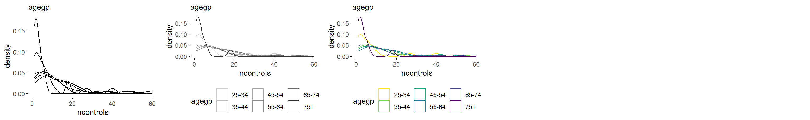
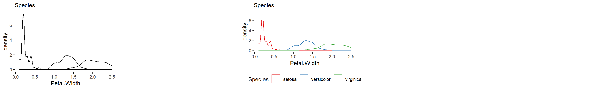
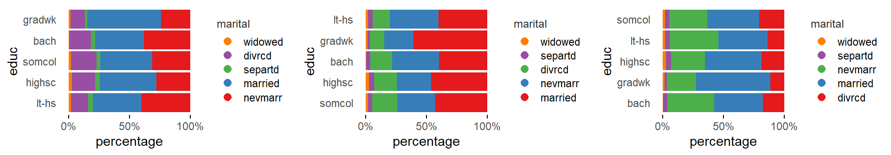

<style>
  .main-container {
  max-width: 1200px !important;
  }
  h1.title {
  font-family: Helvetica, Arial, sans-serif;
  font-size: 20px;
  color: #4d4d4d;
  margin-top: 100px;
  }
  h1 {
  font-family: Helvetica, Arial, sans-serif;
  font-size: 20px;
  color: 4d4d4d;
  margin-top: 35px;
  }
  h2 {
  font-family: Helvetica, Arial, sans-serif;
  font-size: 16px;
  color: #4d4d4d;
  margin-top: 25px;
  font-weight: bold;
  }
  h3 {
  font-family: Helvetica, Arial, sans-serif;
  font-size: 14px;
  color: #4d4d4d;
  margin-top: 15px;
  font-weight: bold;
  }
  h4 {
  font-family: Helvetica, Arial, sans-serif;
  font-size: 14px;
  color: #4d4d4d;
  margin-top: 10px;
  font-style: oblique;
  }
  h4.author {
  font-family: Helvetica, Arial, sans-serif;
  font-size: 10pt;
  margin-top: 0px;
  }
  h4.date {
  font-family: Helvetica, Arial, sans-serif;
  font-size: 10pt;
  margin-top: 0px;
  }
</style>

Specimen of the graphics that only require 1 input variable and that, up to now, are being considered by the brinton's `wideplot()`, `longplot()` and `brinton::plotup()` functions.

```{r, echo=FALSE, message=FALSE, warning=FALSE, comment=FALSE}
knitr::opts_chunk$set(
  message=FALSE, 
  warning=FALSE, 
  comment=NA, 
  dev='png', 
  echo=FALSE
  )
# length(unique(data$vars))/6 + 0.5
```

```{r, echo=FALSE, message=FALSE}
library(dplyr)
library(lubridate)
library(nycflights13)
library(dlstats)
MASS <- cran_stats(c("MASS"))

# library(cranlogs)
# MASS <- cran_downloads(from = "2015-01-01", to = "last-day", c("MASS"))

```


# 2 numeric

```{r 2numeric_01, fig.width=12, fig.height=2.4}
gridExtra::grid.arrange(brinton::plotup(iris, c('Sepal.Width', 'Sepal.Length'), 'scatter plot'),
                        brinton::plotup(iris, c('Sepal.Width', 'Sepal.Length'), 'bw scatter plot'),
                        brinton::plotup(iris, c('Sepal.Width', 'Sepal.Length'), 'color scatter plot'),
                        heights=grid::unit(c(2.4), c("in")),
                        ncol=5)
knitr::include_graphics('../vignettes/figures/2numeric_01-1.png')
cat("2 numeric = c('scatter plot', 'bw scatter plot', 'color scatter plot')")
```

```{r 2numeric_03, fig.width=12, fig.height=2.4}
gridExtra::grid.arrange(brinton::plotup(iris, c('Sepal.Width', 'Sepal.Length'), 'binned scatter plot'),
                        brinton::plotup(iris, c('Sepal.Width', 'Sepal.Length'), 'bw binned scatter plot'),
                        brinton::plotup(iris, c('Sepal.Width', 'Sepal.Length'), 'color binned scatter plot'),
                        heights=grid::unit(c(2.4), c("in")),
                        ncol=5)
knitr::include_graphics('../vignettes/figures/2numeric_03-1.png')
cat("2 numeric = c('binned scatter plot', 'bw binned scatter plot', 'color binned scatter plot')")
```

```{r 2numeric_04, fig.width=12, fig.height=2.4}
gridExtra::grid.arrange(brinton::plotup(iris, c('Sepal.Width', 'Sepal.Length'), 'binned heatmap'),
                        brinton::plotup(iris, c('Sepal.Width', 'Sepal.Length'), 'bw binned heatmap'),
                        brinton::plotup(iris, c('Sepal.Width', 'Sepal.Length'), 'color binned heatmap'),
                        heights=grid::unit(c(2.4), c("in")),
                        ncol=5)
knitr::include_graphics('../vignettes/figures/2numeric_04-1.png')
cat("2 numeric = c('binned heatmap', 'bw binned heatmap', 'color binned heatmap')")
```

```{r 2numeric_05, fig.width=12, fig.height=2.4}
gridExtra::grid.arrange(brinton::plotup(iris, c('Sepal.Width', 'Sepal.Length'), 'hexagonal binned heatmap'),
                        brinton::plotup(iris, c('Sepal.Width', 'Sepal.Length'), 'bw hexagonal binned heatmap'),
                        brinton::plotup(iris, c('Sepal.Width', 'Sepal.Length'), 'color hexagonal binned heatmap'),
                        heights=grid::unit(c(2.4), c("in")),
                        ncol=5)
knitr::include_graphics('../vignettes/figures/2numeric_05-1.png')
cat("2 numeric = c('hexagonal binned heatmap', 'bw hexagonal binned heatmap', 'color hexagonal binned heatmap')")
```

```{r 2numeric_06, fig.width=12, fig.height=2.4}
gridExtra::grid.arrange(brinton::plotup(iris, c('Sepal.Width', 'Sepal.Length'), 'blank'),
                        brinton::plotup(iris, c('Sepal.Width', 'Sepal.Length'), 'bw heatmap'),
                        brinton::plotup(iris, c('Sepal.Width', 'Sepal.Length'), 'color heatmap'),
                        heights=grid::unit(c(2.4), c("in")),
                        ncol=5)
knitr::include_graphics('../vignettes/figures/2numeric_06-1.png')
cat("2 numeric = c('blank', 'bw heatmap', 'color heatmap')")
```

```{r 2numeric_07, fig.width=12, fig.height=2.4}
gridExtra::grid.arrange(brinton::plotup(iris, c('Sepal.Width', 'Sepal.Length'), 'contour plot'),
                        brinton::plotup(iris, c('Sepal.Width', 'Sepal.Length'), 'bw contour plot'),
                        brinton::plotup(iris, c('Sepal.Width', 'Sepal.Length'), 'color contour plot'),
                        heights=grid::unit(c(2.4), c("in")),
                        ncol=5)
knitr::include_graphics('../vignettes/figures/2numeric_07-1.png')
cat("2 numeric = c('contour plot', 'bw contour plot', 'color contour plot')")
```

```{r 2numeric_08, fig.width=12, fig.height=2.4}
gridExtra::grid.arrange(brinton::plotup(iris, c('Sepal.Width', 'Sepal.Length'), 'contour plot with data points'),
                        brinton::plotup(iris, c('Sepal.Width', 'Sepal.Length'), 'bw contour plot with data points'), #BUG
                        brinton::plotup(iris, c('Sepal.Width', 'Sepal.Length'), 'color contour plot with data points'), #BUG
                        heights=grid::unit(c(2.4), c("in")),
                        ncol=5)
knitr::include_graphics('../vignettes/figures/2numeric_08-1.png')
cat("2 numeric = c('contour plot with data points', 'bw contour plot with data points', 'color contour plot with data points')")
```

```{r 2numeric_09, fig.width=12, fig.height=2.4}
gridExtra::grid.arrange(brinton::plotup(iris, c('Sepal.Width', 'Sepal.Length'), 'parallel plot'),
                        brinton::plotup(iris, c('Sepal.Width', 'Sepal.Length'), 'bw parallel plot'),
                        brinton::plotup(iris, c('Sepal.Width', 'Sepal.Length'), 'color parallel plot'),
                        heights=grid::unit(c(2.4), c("in")),
                        ncol=5)
knitr::include_graphics('../vignettes/figures/2numeric_09-1.png')
cat("2 numeric = c('parallel plot', 'bw parallel plot', 'color parallel plot')")
```

```{r 2numeric_10, fig.width=12, fig.height=2.4}
gridExtra::grid.arrange(brinton::plotup(iris, c('Sepal.Width', 'Sepal.Length'), 'unscaled parallel plot'),
                        brinton::plotup(iris, c('Sepal.Width', 'Sepal.Length'), 'unscaled bw parallel plot'),
                        brinton::plotup(iris, c('Sepal.Width', 'Sepal.Length'), 'unscaled color parallel plot'),
                        heights=grid::unit(c(2.4), c("in")),
                        ncol=5)
knitr::include_graphics('../vignettes/figures/2numeric_10-1.png')
cat("2 numeric = c('unscaled parallel plot', 'unscaled bw parallel plot', 'unscaled color parallel plot')")
```

```{r 2numeric_11, fig.width=12, fig.height=2.4}
gridExtra::grid.arrange(brinton::plotup(iris, c('Sepal.Width', 'Sepal.Length'), 'path graph'),
                        brinton::plotup(iris, c('Sepal.Width', 'Sepal.Length'), 'bw path graph'),
                        brinton::plotup(iris, c('Sepal.Width', 'Sepal.Length'), 'color path graph'),
                        heights=grid::unit(c(2.4), c("in")),
                        ncol=5)
knitr::include_graphics('../vignettes/figures/2numeric_11-1.png')
cat("2 numeric = c('path graph', 'bw path graph', 'color path graph')")
```

```{r 2numeric_12, fig.width=12, fig.height=2.4}
gridExtra::grid.arrange(brinton::plotup(iris, c('Sepal.Width', 'Sepal.Length'), 'point-to-point graph'),
                        brinton::plotup(iris, c('Sepal.Width', 'Sepal.Length'), 'bw point-to-point graph'),
                        brinton::plotup(iris, c('Sepal.Width', 'Sepal.Length'), 'color point-to-point graph'),
                        heights=grid::unit(c(2.4), c("in")),
                        ncol=5)
knitr::include_graphics('../vignettes/figures/2numeric_12-1.png')
cat("2 numeric = c('point-to-point graph', 'bw point-to-point graph', 'color point-to-point graph')")
```

```{r 2numeric_13, fig.width=12, fig.height=2.4}
gridExtra::grid.arrange(brinton::plotup(iris, c('Sepal.Width', 'Sepal.Length'), 'point graph'),
                        brinton::plotup(iris, c('Sepal.Width', 'Sepal.Length'), 'bw point graph'),
                        brinton::plotup(iris, c('Sepal.Width', 'Sepal.Length'), 'color point graph'),
                        heights=grid::unit(c(2.4), c("in")),
                        ncol=5)
knitr::include_graphics('../vignettes/figures/2numeric_13-1.png')
cat("2 numeric = c('point graph', 'bw point graph', 'color point graph')")
```

```{r 2numeric_14, fig.width=12, fig.height=2.4}
gridExtra::grid.arrange(brinton::plotup(iris, c('Sepal.Width', 'Sepal.Length'), 'line graph'),
                        brinton::plotup(iris, c('Sepal.Width', 'Sepal.Length'), 'stepped line graph'),
                        heights=grid::unit(c(2.4), c("in")),
                        ncol=5)
knitr::include_graphics('../vignettes/figures/2numeric_14-1.png')
cat("2 numeric = c('line graph', 'stepped line graph')")
```

```{r 2numeric_15, fig.width=12, fig.height=2.4}
gridExtra::grid.arrange(brinton::plotup(iris, c('Sepal.Width', 'Sepal.Length'), 'area graph'),
                        heights=grid::unit(c(2.4), c("in")),
                        ncol=5)
knitr::include_graphics('../vignettes/figures/2numeric_15-1.png')
cat("2 numeric = c('area graph')")
```

```{r 2numeric_16, fig.width=12, fig.height=2.4}
gridExtra::grid.arrange(brinton::plotup(iris, c('Sepal.Width', 'Sepal.Length'), 'stepped area graph'),
                        brinton::plotup(iris, c('Sepal.Width', 'Sepal.Length'), 'bw stepped area graph'),
                        brinton::plotup(iris, c('Sepal.Width', 'Sepal.Length'), 'color stepped area graph'),
                        heights=grid::unit(c(2.4), c("in")),
                        ncol=5)
knitr::include_graphics('../vignettes/figures/2numeric_16-1.png')
cat("2 numeric = c('stepped area graph', 'bw stepped area graph', 'color stepped area graph')")
```

```{r 2numeric_17, fig.width=12, fig.height=2.4}
gridExtra::grid.arrange(brinton::plotup(iris, c('Sepal.Width', 'Sepal.Length'), 'blank'),
                        brinton::plotup(iris, c('Sepal.Width', 'Sepal.Length'), 'bw seq. heatmap'),
                        brinton::plotup(iris, c('Sepal.Width', 'Sepal.Length'), 'color seq. heatmap'),
                        heights=grid::unit(c(2.4), c("in")),
                        ncol=5)
knitr::include_graphics('../vignettes/figures/2numeric_17-1.png')
cat("2 numeric = c('blank', 'bw heatmap', 'color heatmap')")
```

```{r 2numeric_18, fig.width=12, fig.height=2.4}
gridExtra::grid.arrange(brinton::plotup(iris, c('Sepal.Width', 'Sepal.Length'), 'blank'),
                        brinton::plotup(iris, c('Sepal.Width', 'Sepal.Length'), 'bw seq. stripe graph'),
                        brinton::plotup(iris, c('Sepal.Width', 'Sepal.Length'), 'color seq. stripe graph'),
                        heights=grid::unit(c(2.4), c("in")),
                        ncol=5)
knitr::include_graphics('../vignettes/figures/2numeric_18-1.png')
cat("2 numeric = c('blank', 'bw seq. stripe graph', 'color seq. stripe graph')")
```

```{r 2numeric_19, fig.width=12, fig.height=2.4}
gridExtra::grid.arrange(brinton::plotup(iris, c('Sepal.Width', 'Sepal.Length'), 'histogram'),
                        brinton::plotup(iris, c('Sepal.Width', 'Sepal.Length'), 'bw histogram'),
                        brinton::plotup(iris, c('Sepal.Width', 'Sepal.Length'), 'color histogram'),
                        heights=grid::unit(c(2.4), c("in")),
                        ncol=5)
knitr::include_graphics('../vignettes/figures/2numeric_19-1.png')
cat("2 numeric = c('histogram', 'bw histogram', 'color histogram')")
```

```{r 2numeric_20, fig.width=12, fig.height=2.4}
gridExtra::grid.arrange(brinton::plotup(iris, c('Sepal.Width', 'Sepal.Length'), 'freq. polygon'),
                        heights=grid::unit(c(2.4), c("in")),
                        ncol=5)
knitr::include_graphics('../vignettes/figures/2numeric_20-1.png')
cat("2 numeric = c('freq. polygon'))")
```

```{r 2numeric_21, fig.width=12, fig.height=2.4}
gridExtra::grid.arrange(brinton::plotup(iris, c('Sepal.Width', 'Sepal.Length'), 'density plot'),
                        brinton::plotup(iris, c('Sepal.Width', 'Sepal.Length'), 'filled density plot'),
                        heights=grid::unit(c(2.4), c("in")),
                        ncol=5)
knitr::include_graphics('../vignettes/figures/2numeric_21-1.png')
cat("2 numeric = c('density plot', 'filled density plot')")
```

```{r 2numeric_22, fig.width=12, fig.height=2.4}
gridExtra::grid.arrange(brinton::plotup(iris, c('Sepal.Width', 'Sepal.Length'), 'violin plot'),
                        brinton::plotup(iris, c('Sepal.Width', 'Sepal.Length'), 'filled violin plot'),
                        heights=grid::unit(c(2.4), c("in")),
                        ncol=5)
knitr::include_graphics('../vignettes/figures/2numeric_22-1.png')
cat("2 numeric = c('violin plot', 'filled violin plot')")
```

```{r 2numeric_23, fig.width=12, fig.height=2.4}
gridExtra::grid.arrange(brinton::plotup(iris, c('Sepal.Width', 'Sepal.Length'), 'box plot'),
                        heights=grid::unit(c(2.4), c("in")),
                        ncol=5)
knitr::include_graphics('../vignettes/figures/2numeric_23-1.png') 
cat("2 numeric = c('box plot'))")
```

```{r 2numeric_24, fig.width=12, fig.height=2.4}
gridExtra::grid.arrange(brinton::plotup(iris, c('Sepal.Width', 'Sepal.Length'), 'ecdf plot'),
                        brinton::plotup(iris, c('Sepal.Width', 'Sepal.Length'), 'point ecdf plot'),
                        brinton::plotup(iris, c('Sepal.Width', 'Sepal.Length'), 'stepped ecdf plot'),
                        heights=grid::unit(c(2.4), c("in")),
                        ncol=5)
knitr::include_graphics('../vignettes/figures/2numeric_24-1.png')
cat("2 numeric = c('ecdf plot', 'point ecdf plot', 'stepped ecdf plot')")
```

# 2 datetime

```{r}
make_datetime_100 <- function(year, month, day, time) {
  make_datetime(year, month, day, time %/% 100, time %% 100)
}

flights_dt <- flights %>%
  filter(!is.na(dep_time), !is.na(arr_time)) %>%
  mutate(
    dep_time = make_datetime_100(year, month, day, dep_time),
    arr_time = make_datetime_100(year, month, day, arr_time),
    sched_dep_time = make_datetime_100(year, month, day, sched_dep_time),
    sched_arr_time = make_datetime_100(year, month, day, sched_arr_time)
  ) %>%
  select(origin, dest, ends_with("delay"), ends_with("time"))

flights_dt <- as.data.frame(flights_dt)

random_1 <- c(29, 43, 22, 108, 29, 79, 7, 111, 33, 122, 116, 120, 48, 87, 136, 134, 109, 49, 57, 101, 53, 126, 7, 36, 207, 171, 76, 60, 22, 135, 27, 175, 107, 163, 99, 25, 56, 30, 53, 11, 24, 8, 45, 47, 117, 65, 61, 24, 209, 212, 199, 120, 17, 40, 86, 54, 96, 80, 4, 112, 124, 47, 71, 92, 65, 16, 28, 89, 58, 76, 36, 87, 62, 92, 13, 8, 62, 55, 22, 91, 19, 190, 124, 85, 115, 149, 118, 6, 97, 41, 71, 13, 23, 26, 110, 175, 137, 220, 175, 6)
random_2 <- c(53, 20, 41, 228, 163, 105, 219, 61, 9, 122, 51, 169, 59, 246, 157, 33, 105, 115, 20, 34, 33, 27, 107, 19, 52, 17, 57, 91, 138, 51, 23, 107, 88, 266, 92, 33, 85, 3, 122, 25, 153, 37, 39, 16, 91, 116, 49, 1, 48, 119, 320, 114, 176, 147, 61, 1, 162, 34, 47, 237, 253, 63, 260, 84, 72, 96, 141, 56, 97, 14, 38, 152, 100, 33, 100, 46, 207, 28, 125, 110, 39, 49, 70, 61, 113, 180, 75, 27, 12, 84, 39, 2, 42, 119, 22, 124, 32, 82, 20, 70)

ds <- data.frame("dep_time" = flights_dt[random_1,5], "arr_time" = flights_dt[random_2,6])
```


```{r 2datetime_01, fig.width=12, fig.height=2.4}
gridExtra::grid.arrange(brinton::plotup(ds, c('dep_time', 'arr_time'), 'scatter plot'),
                        brinton::plotup(ds, c('dep_time', 'arr_time'), 'scatter plot with trend line'),
                        heights=grid::unit(c(2.4), c("in")),
                        ncol=5)
knitr::include_graphics('../vignettes/figures/2datetime_01-1.png')
cat("2 datetime = c('scatter plot', 'scatter plot with trend line')")
```

```{r 2datetime_02, fig.width=12, fig.height=2.4}
gridExtra::grid.arrange(brinton::plotup(ds, c('dep_time', 'arr_time'), 'binned scatter plot'),
                        brinton::plotup(ds, c('dep_time', 'arr_time'), 'bw binned scatter plot'),
                        brinton::plotup(ds, c('dep_time', 'arr_time'), 'color binned scatter plot'),
                        heights=grid::unit(c(2.4), c("in")),
                        ncol=5)
knitr::include_graphics('../vignettes/figures/2datetime_02-1.png')
cat("2 datetime = c('binned scatter plot', 'bw binned scatter plot', 'color binned scatter plot')")
```

```{r 2datetime_03, fig.width=12, fig.height=2.4}
gridExtra::grid.arrange(brinton::plotup(ds, c('dep_time', 'arr_time'), 'blank'),
                        brinton::plotup(ds, c('dep_time', 'arr_time'), 'bw heatmap'),
                        brinton::plotup(ds, c('dep_time', 'arr_time'), 'color heatmap'),
                        heights=grid::unit(c(2.4), c("in")),
                        ncol=5)
knitr::include_graphics('../vignettes/figures/2datetime_03-1.png')
cat("2 datetime = c('blank', 'bw heatmap', 'color heatmap')")
```

```{r 2datetime_04, fig.width=12, fig.height=2.4}
gridExtra::grid.arrange(brinton::plotup(ds, c('dep_time', 'arr_time'), 'contour plot with data points'),
                        heights=grid::unit(c(2.4), c("in")),
                        ncol=5)
knitr::include_graphics('../vignettes/figures/2datetime_04-1.png')
cat("2 datetime = c('contour plot with data points')")
```

```{r 2datetime_05, fig.width=12, fig.height=2.4}
gridExtra::grid.arrange(brinton::plotup(ds, c('dep_time', 'arr_time'), 'path graph'),
                        brinton::plotup(ds, c('dep_time', 'arr_time'), 'bw path graph'),
                        brinton::plotup(ds, c('dep_time', 'arr_time'), 'color path graph'),
                        heights=grid::unit(c(2.4), c("in")),
                        ncol=5)
knitr::include_graphics('../vignettes/figures/2datetime_05-1.png')
cat("2 datetime = c('path graph', 'bw path graph', 'color path graph')")
```

```{r 2datetime_06, fig.width=12, fig.height=2.4}
gridExtra::grid.arrange(brinton::plotup(ds, c('dep_time', 'arr_time'), 'point-to-point graph'),
                        brinton::plotup(ds, c('dep_time', 'arr_time'), 'bw point-to-point graph'),
                        brinton::plotup(ds, c('dep_time', 'arr_time'), 'color point-to-point graph'),
                        heights=grid::unit(c(2.4), c("in")),
                        ncol=5)
knitr::include_graphics('../vignettes/figures/2datetime_06-1.png')
cat("2 datetime = c('point-to-point graph', 'bw point-to-point graph', 'color point-to-point graph')")
```

# numeric~datetime

```{r date-num_01, fig.width=12, fig.height=2.4}
gridExtra::grid.arrange(brinton::plotup(MASS, c('start', 'downloads'), 'scatter plot'),
                        brinton::plotup(MASS, c('start', 'downloads'), 'scatter plot with trend line'),
                        heights=grid::unit(c(2.4), c("in")),
                        ncol=5)
knitr::include_graphics('../vignettes/figures/date-num_01-1.png')
cat("numeric~datetime = c('scatter plot', 'scatter plot with trend line')")
```

```{r date-num_02, fig.width=12, fig.height=2.4}
gridExtra::grid.arrange(brinton::plotup(MASS, c('start', 'downloads'), 'binned scatter plot'),
                        brinton::plotup(MASS, c('start', 'downloads'), 'bw binned scatter plot'),
                        brinton::plotup(MASS, c('start', 'downloads'), 'color binned scatter plot'),
                        heights=grid::unit(c(2.4), c("in")),
                        ncol=5)
knitr::include_graphics('../vignettes/figures/date-num_02-1.png')
cat("numeric~datetime = c('binned scatter plot', 'bw binned scatter plot', 'color binned scatter plot')")
```

```{r date-num_03, fig.width=12, fig.height=2.4}
gridExtra::grid.arrange(brinton::plotup(MASS, c('start', 'downloads'), 'blank'),
                        brinton::plotup(MASS, c('start', 'downloads'), 'bw heatmap'),
                        brinton::plotup(MASS, c('start', 'downloads'), 'color heatmap'),
                        heights=grid::unit(c(2.4), c("in")),
                        ncol=5)
knitr::include_graphics('../vignettes/figures/date-num_03-1.png')
cat("numeric~datetime = c('blank', 'bw heatmap', 'color heatmap')")
```

```{r date-num_04, fig.width=12, fig.height=2.4}
gridExtra::grid.arrange(brinton::plotup(MASS, c('start', 'downloads'), 'contour plot with data points'),
                        heights=grid::unit(c(2.4), c("in")),
                        ncol=5)
knitr::include_graphics('../vignettes/figures/date-num_04-1.png')
cat("numeric~datetime = c('contour plot with data points')")
```

```{r date-num_05, fig.width=12, fig.height=2.4}
gridExtra::grid.arrange(brinton::plotup(MASS, c('start', 'downloads'), 'path graph'),
                        brinton::plotup(MASS, c('start', 'downloads'), 'bw path graph'),
                        brinton::plotup(MASS, c('start', 'downloads'), 'color path graph'),
                        heights=grid::unit(c(2.4), c("in")),
                        ncol=5)

cat("numeric~datetime = c('path graph', 'bw path graph', 'color path graph')")
```

```{r date-num_06, fig.width=12, fig.height=2.4}
gridExtra::grid.arrange(brinton::plotup(MASS, c('start', 'downloads'), 'point-to-point graph'),
                        brinton::plotup(MASS, c('start', 'downloads'), 'bw point-to-point graph'),
                        brinton::plotup(MASS, c('start', 'downloads'), 'color point-to-point graph'),
                        heights=grid::unit(c(2.4), c("in")),
                        ncol=5)
knitr::include_graphics('../vignettes/figures/date-num_06-1.png')
cat("numeric~datetime = c('point-to-point graph', 'bw point-to-point graph', 'color point-to-point graph')")
```

# numeric~ordered factor

```{r num-ord_01, fig.width=12, fig.height=1.5}
gridExtra::grid.arrange(brinton::plotup(esoph, c("agegp", "ncontrols"), 'path graph'),
                        ncol=5)
knitr::include_graphics('../vignettes/figures/num-ord_01-1.png')
cat("numeric~ordered = c('path graph', 'freq. reordered path graph', 'alphab. reordered path graph')")
```

```{r num-ord_02, fig.width=12, fig.height=1.5}
gridExtra::grid.arrange(brinton::plotup(esoph, c("agegp", "ncontrols"), 'point graph'),
                        ncol=5)
knitr::include_graphics('../vignettes/figures/num-ord_02-1.png')
cat("numeric~ordered = c('point graph', 'freq. reordered point graph', 'alphab. reordered point graph')")
```

```{r num-ord_03, fig.width=12, fig.height=1.5}
gridExtra::grid.arrange(brinton::plotup(esoph, c("agegp", "ncontrols"), 'tile plot'),
                        ncol=5)
knitr::include_graphics('../vignettes/figures/num-ord_03-1.png')
cat("numeric~ordered = c('tile plot', 'freq. reordered tile plot', 'alphab. reordered tile plot')")
```

```{r num-ord_04, fig.width=12, fig.height=1.5}
gridExtra::grid.arrange(brinton::plotup(esoph, c("agegp", "ncontrols"), 'binned heatmap'),
                        ncol=5)
knitr::include_graphics('../vignettes/figures/num-ord_04-1.png')
cat("numeric~ordered = c('binned heatmap', 'freq. reordered binned heatmap', 'alphab. reordered binned heatmap')")
```

```{r num-ord_05, fig.width=12, fig.height=1.5}
gridExtra::grid.arrange(brinton::plotup(esoph, c("agegp", "ncontrols"), 'bw binned heatmap'),
                        ncol=5)
knitr::include_graphics('../vignettes/figures/num-ord_05-1.png')
cat("numeric~ordered = c('bw binned heatmap', 'bw freq. reordered binned heatmap', 'bw alphab. reordered binned heatmap')")
```

```{r num-ord_06, fig.width=12, fig.height=1.5}
gridExtra::grid.arrange(brinton::plotup(esoph, c("agegp", "ncontrols"), 'color binned heatmap'),
                        ncol=5)
knitr::include_graphics('../vignettes/figures/num-ord_06-1.png')
cat("numeric~ordered = c('color binned heatmap', 'color freq. reordered binned heatmap', 'color alphab. reordered binned heatmap')")
```

```{r num-ord_07, fig.width=12, fig.height=1.5}
gridExtra::grid.arrange(brinton::plotup(esoph, c("agegp", "ncontrols"), 'violin plot'),
                        ncol=5)
knitr::include_graphics('../vignettes/figures/num-ord_07-1.png')
cat("numeric~ordered = c('violin plot', 'freq. reordered violin plot', 'alphab. reordered violin plot')")
```

```{r num-ord_08, fig.width=12, fig.height=1.5}
gridExtra::grid.arrange(brinton::plotup(esoph, c("agegp", "ncontrols"), 'filled violin plot'),
                        ncol=5)
knitr::include_graphics('../vignettes/figures/num-ord_08-1.png')
cat("numeric~ordered = c('filled violin plot', 'freq. reordered filled violin plot', 'alphab. reordered filled violin plot')")
```

```{r num-ord_09, fig.width=12, fig.height=1.5}
gridExtra::grid.arrange(brinton::plotup(esoph, c("agegp", "ncontrols"), 'box plot'),
                        ncol=5)
knitr::include_graphics('../vignettes/figures/num-ord_09-1.png')
cat("numeric~ordered = c('box plot', 'freq. reordered box plot', 'alphab. reordered box plot')")
```

```{r num-ord_10, fig.width=12, fig.height=2.4}
gridExtra::grid.arrange(brinton::plotup(esoph, c("agegp", "ncontrols"), 'blank'),
                        brinton::plotup(esoph, c("agegp", "ncontrols"), 'bw stacked histogram'),
                        brinton::plotup(esoph, c("agegp", "ncontrols"), 'color stacked histogram'),
                        heights=grid::unit(c(2.4), c("in")),
                        ncol=5)

cat("numeric~ordered = c('blank', 'bw stacked histogram', 'color stacked histogram')")
```

```{r num-ord_11, fig.width=12, fig.height=2.4, warning=FALSE, message=FALSE}
gridExtra::grid.arrange(brinton::plotup(esoph, c("agegp", "ncontrols"), 'blank'),
                        brinton::plotup(esoph, c("agegp", "ncontrols"), 'bw 100% stacked histogram'),
                        brinton::plotup(esoph, c("agegp", "ncontrols"), 'color 100% stacked histogram'),
                        heights=grid::unit(c(2.4), c("in")),
                        ncol=5)
knitr::include_graphics('../vignettes/figures/num-ord_11-1.png')
cat("numeric~ordered = c('blank', 'bw 100% stacked histogram', 'color 100% stacked histogram')")
```

```{r num-ord_12, fig.width=12, fig.height=2.4}
gridExtra::grid.arrange(brinton::plotup(esoph, c("agegp", "ncontrols"), 'density plot'),
                        brinton::plotup(esoph, c("agegp", "ncontrols"), 'bw density plot'),
                        brinton::plotup(esoph, c("agegp", "ncontrols"), 'color density plot'),
                        heights=grid::unit(c(2.4), c("in")),
                        ncol=5)

cat("numeric~ordered = c('density plot', 'blank', 'color density plot')")
```

```{r num-ord_13, fig.width=12, fig.height=2.4}
gridExtra::grid.arrange(brinton::plotup(esoph, c("agegp", "ncontrols"), 'blank'),
                        brinton::plotup(esoph, c("agegp", "ncontrols"), 'bw filled density plot'),
                        brinton::plotup(esoph, c("agegp", "ncontrols"), 'color filled density plot'),
                        heights=grid::unit(c(2.4), c("in")),
                        ncol=5)
knitr::include_graphics('../vignettes/figures/num-ord_13-1.png')
cat("numeric~ordered = c('blank', 'filled density plot', 'color filled density plot')")
```

# numeric~factor

```{r fac-num_01, fig.width=12, fig.height=1.16}
gridExtra::grid.arrange(brinton::plotup(Ecdat::HI, c("region", "whrswk"), 'path graph'),
                        brinton::plotup(Ecdat::HI, c("region", "whrswk"), 'freq. reordered path graph'),
                        brinton::plotup(Ecdat::HI, c("region", "whrswk"), 'alphab. reordered path graph'),
                        heights=grid::unit(c(1.16), c('in')),
                        ncol=5)
knitr::include_graphics('../vignettes/figures/fac-num_01-1.png')
cat("numeric~factor = c('path graph', 'freq. reordered path graph', 'alphab. reordered path graph')")
```

```{r fac-num_02, fig.width=12, fig.height=1.16}
gridExtra::grid.arrange(brinton::plotup(Ecdat::HI, c("region", "whrswk"), 'point graph'),
                        brinton::plotup(Ecdat::HI, c("region", "whrswk"), 'freq. reordered point graph'),
                        brinton::plotup(Ecdat::HI, c("region", "whrswk"), 'alphab. reordered point graph'),
                        heights=grid::unit(c(1.16), c('in')),
                        ncol=5)
knitr::include_graphics('../vignettes/figures/fac-num_02-1.png')
cat("numeric~factor = c('point graph', 'freq. reordered point graph', 'alphab. reordered point graph')")
```

```{r fac-num_03, fig.width=12, fig.height=1.16}
gridExtra::grid.arrange(brinton::plotup(Ecdat::HI, c("region", "whrswk"), 'tile plot'),
                        brinton::plotup(Ecdat::HI, c("region", "whrswk"), 'freq. reordered tile plot'),
                        brinton::plotup(Ecdat::HI, c("region", "whrswk"), 'alphab. reordered tile plot'),
                        heights=grid::unit(c(1.16), c('in')),
                        ncol=5)
knitr::include_graphics('../vignettes/figures/fac-num_03-1.png')
cat("numeric~factor = c('tile plot', 'freq. reordered tile plot', 'alphab. reordered tile plot')")
```

```{r fac-num_04, fig.width=12, fig.height=1.16}
gridExtra::grid.arrange(brinton::plotup(Ecdat::HI, c("region", "whrswk"), 'binned heatmap'),
                        brinton::plotup(Ecdat::HI, c("region", "whrswk"), 'freq. reordered binned heatmap'),
                        brinton::plotup(Ecdat::HI, c("region", "whrswk"), 'alphab. reordered binned heatmap'),
                        heights=grid::unit(c(1.16), c("in")),
                        ncol=5)
knitr::include_graphics('../vignettes/figures/fac-num_04-1.png')
cat("numeric~factor = c('binned heatmap', 'freq. reordered binned heatmap', 'alphab. reordered binned heatmap')")
```

```{r fac-num_05, fig.width=12, fig.height=1.16}
gridExtra::grid.arrange(brinton::plotup(Ecdat::HI, c("region", "whrswk"), 'bw binned heatmap'),
                        brinton::plotup(Ecdat::HI, c("region", "whrswk"), 'bw freq. reordered binned heatmap'),
                        brinton::plotup(Ecdat::HI, c("region", "whrswk"), 'bw alphab. reordered binned heatmap'),
                        heights=grid::unit(c(1.16), c("in")),
                        ncol=5)
knitr::include_graphics('../vignettes/figures/fac-num_05-1.png')
cat("numeric~factor = c('bw binned heatmap', 'bw freq. reordered binned heatmap', 'bw alphab. reordered binned heatmap')")
```

```{r fac-num_06, fig.width=12, fig.height=1.16}
gridExtra::grid.arrange(brinton::plotup(Ecdat::HI, c("region", "whrswk"), 'color binned heatmap'),
                        brinton::plotup(Ecdat::HI, c("region", "whrswk"), 'color freq. reordered binned heatmap'),
                        brinton::plotup(Ecdat::HI, c("region", "whrswk"), 'color alphab. reordered binned heatmap'),
                        heights=grid::unit(c(1.16), c("in")),
                        ncol=5)
knitr::include_graphics('../vignettes/figures/fac-num_06-1.png')
cat("numeric~factor = c('color binned heatmap', 'color freq. reordered binned heatmap', 'color alphab. reordered binned heatmap')")
```

```{r fac-num_07, fig.width=12, fig.height=1.5}
gridExtra::grid.arrange(brinton::plotup(Ecdat::Car, c("type1", "price1"), 'violin plot'),
                        brinton::plotup(Ecdat::Car, c("type1", "price1"), 'freq. reordered violin plot'),
                        brinton::plotup(Ecdat::Car, c("type1", "price1"), 'alphab. reordered violin plot'),
                        heights=grid::unit(c(1.5), c("in")),
                        ncol=5)
knitr::include_graphics('../vignettes/figures/fac-num_07-1.png')
cat("numeric~factor = c('violin plot', 'freq. reordered violin plot', 'alphab. reordered violin plot')")
```

```{r fac-num_08, fig.width=12, fig.height=1.5}
gridExtra::grid.arrange(brinton::plotup(Ecdat::Car, c("type1", "price1"), 'filled violin plot'),
                        brinton::plotup(Ecdat::Car, c("type1", "price1"), 'freq. reordered filled violin plot'),
                        brinton::plotup(Ecdat::Car, c("type1", "price1"), 'alphab. reordered filled violin plot'),
                        heights=grid::unit(c(1.5), c("in")),
                        ncol=5)
knitr::include_graphics('../vignettes/figures/fac-num_08-1.png')
cat("numeric~factor = c('filled violin plot', 'freq. reordered filled violin plot', 'alphab. reordered filled violin plot')")
```

```{r fac-num_09, fig.width=12, fig.height=1.5}
gridExtra::grid.arrange(brinton::plotup(Ecdat::Car, c("type1", "price1"), 'box plot'),
                        brinton::plotup(Ecdat::Car, c("type1", "price1"), 'freq. reordered box plot'),
                        brinton::plotup(Ecdat::Car, c("type1", "price1"), 'alphab. reordered box plot'),
                        heights=grid::unit(c(1.5), c("in")),
                        ncol=5)
knitr::include_graphics('../vignettes/figures/fac-num_09-1.png')
cat("numeric~factor = c('box plot', 'freq. reordered box plot', 'alphab. reordered box plot')")
```

```{r fac-num_10, fig.width=12, fig.height=2.4}
gridExtra::grid.arrange(brinton::plotup(iris, c('Species', 'Petal.Width'), 'blank'),
                        brinton::plotup(iris, c('Species', 'Petal.Width'), 'bw stacked histogram'),
                        brinton::plotup(iris, c('Species', 'Petal.Width'), 'color stacked histogram'),
                        heights=grid::unit(c(2.4), c("in")),
                        ncol=5)
knitr::include_graphics('../vignettes/figures/fac-num_10-1.png')
cat("numeric~factor = c('blank', 'bw stacked histogram', 'color stacked histogram')")
```

```{r fac-num_11, fig.width=12, fig.height=2.4}
gridExtra::grid.arrange(brinton::plotup(iris, c('Species', 'Petal.Width'), 'blank'),
                        brinton::plotup(iris, c('Species', 'Petal.Width'), 'bw 100% stacked histogram'),
                        brinton::plotup(iris, c('Species', 'Petal.Width'), 'color 100% stacked histogram'),
                        heights=grid::unit(c(2.4), c("in")),
                        ncol=5)
knitr::include_graphics('../vignettes/figures/fac-num_11-1.png')
cat("numeric~factor = c('blank', 'bw 100% stacked histogram', 'color 100% stacked histogram')")
```

```{r fac-num_12, fig.width=12, fig.height=2.4}
gridExtra::grid.arrange(brinton::plotup(iris, c('Species', 'Petal.Width'), 'density plot'),
                        brinton::plotup(iris, c('Species', 'Petal.Width'), 'blank'),
                        brinton::plotup(iris, c('Species', 'Petal.Width'), 'color density plot'),
                        heights=grid::unit(c(2.4), c("in")),
                        ncol=5)

cat("numeric~factor = c('density plot', 'blank', 'color density plot')")
```

```{r fac-num_13, fig.width=12, fig.height=2.4}
gridExtra::grid.arrange(brinton::plotup(iris, c('Species', 'Petal.Width'), 'blank'),
                        brinton::plotup(iris, c('Species', 'Petal.Width'), 'filled density plot'),
                        brinton::plotup(iris, c('Species', 'Petal.Width'), 'color filled density plot'),
                        heights=grid::unit(c(2.4), c("in")),
                        ncol=5)

cat("numeric~factor = c('blank', 'filled density plot', 'color filled density plot')")
```

# 2 ordered

```{r 2ordered_01, fig.width=10, fig.height=1.5}
gridExtra::grid.arrange(brinton::plotup(esoph, c('agegp', 'alcgp'), 'bw stacked bar graph'),
                        brinton::plotup(esoph, c('agegp', 'alcgp'), 'color stacked bar graph'),
                        heights=grid::unit(c(1.5), c("in")),
                        ncol=3)
knitr::include_graphics('../vignettes/figures/2ordered_01-1.png')
cat("2 ordered = c('bw stacked bar graph', 'color stacked bar graph')")
```

```{r 2ordered_02, fig.width=10, fig.height=2}
gridExtra::grid.arrange(brinton::plotup(esoph, c('agegp', 'alcgp'), 'transposed bw stacked bar graph'),
                        brinton::plotup(esoph, c('agegp', 'alcgp'), 'transposed color stacked bar graph'),
                        heights=grid::unit(c(2), c("in")),
                        ncol=3)
knitr::include_graphics('../vignettes/figures/2ordered_02-1.png')
cat("2 ordered = c('transposed bw stacked bar graph', 'transposed color stacked bar graph')")
```

```{r 2ordered_03, fig.width=10, fig.height=1.5}
gridExtra::grid.arrange(brinton::plotup(esoph, c('agegp', 'alcgp'), 'bw 100% stacked bar graph'),
                        brinton::plotup(esoph, c('agegp', 'alcgp'), 'color 100% stacked bar graph'),
                        heights=grid::unit(c(1.5), c("in")),
                        ncol=3)
knitr::include_graphics('../vignettes/figures/2ordered_03-1.png')
cat("2 ordered = c('bw 100% stacked bar graph', 'color 100% stacked bar graph')")
```

```{r 2ordered_04, fig.width=10, fig.height=2}
gridExtra::grid.arrange(brinton::plotup(esoph, c('agegp', 'alcgp'), 'transposed bw 100% stacked bar graph'),
                        brinton::plotup(esoph, c('agegp', 'alcgp'), 'transposed color 100% stacked bar graph'),
                        heights=grid::unit(c(2), c("in")),
                        ncol=3)
knitr::include_graphics('../vignettes/figures/2ordered_04-1.png')
cat("2 ordered = c('transposed bw 100% stacked bar graph', 'transposed color 100% stacked bar graph')")
```

```{r 2ordered_05, fig.width=10, fig.height=2}
gridExtra::grid.arrange(brinton::plotup(esoph, c('agegp', 'alcgp'), 'bw heatmap'),
                        brinton::plotup(esoph, c('agegp', 'alcgp'), 'color heatmap'),
                        heights=grid::unit(c(2), c("in")),
                        ncol=3)
knitr::include_graphics('../vignettes/figures/2ordered_05-1.png')
cat("2 ordered = c('bw heatmap', 'color heatmap')")
```

```{r 2ordered_06, fig.width=10, fig.height=2}
gridExtra::grid.arrange(brinton::plotup(esoph, c('agegp', 'alcgp'), 'blank'),
                        brinton::plotup(esoph, c('agegp', 'alcgp'), 'color residuals heatmap'),
                        heights=grid::unit(c(2), c("in")),
                        ncol=3)
knitr::include_graphics('../vignettes/figures/2ordered_06-1.png')
cat("2 ordered = c('blank', 'color residuals heatmap')")
```

```{r 2ordered_07, fig.width=10, fig.height=2}
gridExtra::grid.arrange(brinton::plotup(esoph, c('agegp', 'alcgp'), 'bw contribution to x2 heatmap'),
                        brinton::plotup(esoph, c('agegp', 'alcgp'), 'color contribution to x2 heatmap'),
                        heights=grid::unit(c(2), c("in")),
                        ncol=3)
knitr::include_graphics('../vignettes/figures/2ordered_07-1.png')
cat("2 ordered = c('bw contribution to x2 heatmap', 'color contribution to x2 heatmap')")
```

```{r 2ordered_08, fig.width=10, fig.height=2}
gridExtra::grid.arrange(brinton::plotup(esoph, c('agegp', 'alcgp'), 'bw balloon plot'),
                        brinton::plotup(esoph, c('agegp', 'alcgp'), 'color balloon plot'),
                        heights=grid::unit(c(2), c("in")),
                        ncol=3)
knitr::include_graphics('../vignettes/figures/2ordered_08-1.png')
cat("2 ordered = c('bw balloon plot', 'color balloon plot')")
```

```{r 2ordered_09, fig.width=10, fig.height=2}
gridExtra::grid.arrange(brinton::plotup(esoph, c('agegp', 'alcgp'), 'blank'),
                        brinton::plotup(esoph, c('agegp', 'alcgp'), 'color residuals balloon plot'),
                        heights=grid::unit(c(2), c("in")),
                        ncol=3)
knitr::include_graphics('../vignettes/figures/2ordered_08-1.png')
cat("2 ordered = c('blank', 'color residuals balloon plot')")
```

```{r 2ordered_10, fig.width=10, fig.height=2}
gridExtra::grid.arrange(brinton::plotup(esoph, c('agegp', 'alcgp'), 'bw contribution to x2 balloon plot'),
                        brinton::plotup(esoph, c('agegp', 'alcgp'), 'color contribution to x2 balloon plot'),
                        heights=grid::unit(c(2), c("in")),
                        ncol=3)
knitr::include_graphics('../vignettes/figures/2ordered_10-1.png')
cat("2 ordered = c('bw contribution to x2 balloon plot', 'color contribution to x2 balloon plot')")
```

# 2 factor

```{r 2factor_01, fig.width=10, fig.height=1.75}
gridExtra::grid.arrange(brinton::plotup(mediation::jobs, c("educ", "marital"), 'color stacked bar graph'),
                        brinton::plotup(mediation::jobs, c("educ", "marital"), 'color freq. reordered stacked bar graph'),
                        brinton::plotup(mediation::jobs, c("educ", "marital"), 'color alphab. reordered stacked bar graph'),
                        heights=grid::unit(c(1.75), c("in")),
                        ncol=3)
knitr::include_graphics('../vignettes/figures/2factor_01-1.png')
cat("2 factor = c('color stacked bar graph', 'color freq. reordered stacked bar graph', 'color alphab. reordered stacked bar graph')")
```

```{r 2factor_02, fig.width=10, fig.height=1.75}
gridExtra::grid.arrange(brinton::plotup(mediation::jobs, c("educ", "marital"), 'transposed color stacked bar graph'),
                        brinton::plotup(mediation::jobs, c("educ", "marital"), 'transposed color freq. reordered stacked bar graph'),
                        brinton::plotup(mediation::jobs, c("educ", "marital"), 'transposed color alphab. reordered stacked bar graph'),
                        heights=grid::unit(c(1.75), c("in")),
                        ncol=3)
knitr::include_graphics('../vignettes/figures/2factor_02-1.png')
cat("2 factor = c('transposed color stacked bar graph', 'transposed color freq. reordered stacked bar graph', 'transposed color alphab. reordered stacked bar graph')")
```

```{r 2factor_03, fig.width=10, fig.height=1.75}
gridExtra::grid.arrange(brinton::plotup(mediation::jobs, c("educ", "marital"), 'color 100% stacked bar graph'),
                        brinton::plotup(mediation::jobs, c("educ", "marital"), 'color freq. reordered 100% stacked bar graph'),
                        brinton::plotup(mediation::jobs, c("educ", "marital"), 'color alphab. reordered 100% stacked bar graph'),
                        heights=grid::unit(c(1.75), c("in")),
                        ncol=3)
knitr::include_graphics('../vignettes/figures/2factor_03-1.png')
cat("2 factor = c('color 100% stacked bar graph', 'color freq. reordered 100% stacked bar graph', 'color alphab. reordered 100% stacked bar graph')")
```


```{r 2factor_04, fig.width=10, fig.height=1.75}
gridExtra::grid.arrange(brinton::plotup(mediation::jobs, c("educ", "marital"), 'transposed color 100% stacked bar graph'),
                        brinton::plotup(mediation::jobs, c("educ", "marital"), 'transposed color freq. reordered 100% stacked bar graph'),
                        brinton::plotup(mediation::jobs, c("educ", "marital"), 'transposed color alphab. reordered 100% stacked bar graph'),
                        heights=grid::unit(c(1.75), c("in")),
                        ncol=3)

cat("2 factor = c('transposed color 100% stacked bar graph', 'transposed color freq. reordered 100% stacked bar graph', 'transposed color alphab. reordered 100% stacked bar graph')")
```

```{r 2factor_05, fig.width=9, fig.height=2.1}
gridExtra::grid.arrange(brinton::plotup(mediation::jobs, c("educ", "marital"), 'bw heatmap'),
                        brinton::plotup(mediation::jobs, c("educ", "marital"), 'bw freq. reordered heatmap'),
                        brinton::plotup(mediation::jobs, c("educ", "marital"), 'bw alphab. reordered heatmap'),
                        heights=grid::unit(c(2.1), c("in")),
                        ncol=3)
knitr::include_graphics('../vignettes/figures/2factor_05-1.png')
cat("2 factor = c('bw heatmap', 'bw freq. reordered heatmap', 'bw alphab. reordered heatmap')")
```

```{r 2factor_06, fig.width=9, fig.height=2.1}
gridExtra::grid.arrange(brinton::plotup(mediation::jobs, c("educ", "marital"), 'color heatmap'),
                        brinton::plotup(mediation::jobs, c("educ", "marital"), 'color freq. reordered heatmap'),
                        brinton::plotup(mediation::jobs, c("educ", "marital"), 'color alphab. reordered heatmap'),
                        heights=grid::unit(c(2.1), c("in")),
                        ncol=3)
knitr::include_graphics('../vignettes/figures/2factor_06-1.png')
cat("2 factor = c('color heatmap', 'color freq. reordered heatmap', 'color alphab. reordered heatmap')")
```

```{r 2factor_07, fig.width=9, fig.height=2.1}
gridExtra::grid.arrange(brinton::plotup(mediation::jobs, c("educ", "marital"), 'color residuals heatmap'),
                        brinton::plotup(mediation::jobs, c("educ", "marital"), 'color freq. reordered residuals heatmap'),
                        brinton::plotup(mediation::jobs, c("educ", "marital"), 'color alphab. reordered residuals heatmap'),
                        heights=grid::unit(c(2.1), c("in")),
                        ncol=3)
knitr::include_graphics('../vignettes/figures/2factor_07-1.png')
cat("2 factor = c('color residuals heatmap', 'color freq. reordered residuals heatmap', 'color alphab. reordered residuals heatmap')")
```

```{r 2factor_08, fig.width=9, fig.height=2.1}
gridExtra::grid.arrange(brinton::plotup(mediation::jobs, c("educ", "marital"), 'bw contribution to x2 heatmap'),
                        brinton::plotup(mediation::jobs, c("educ", "marital"), 'bw freq. reordered contribution to x2 heatmap'),
                        brinton::plotup(mediation::jobs, c("educ", "marital"), 'bw alphab. reordered contribution to x2 heatmap'),
                        heights=grid::unit(c(2.1), c("in")),
                        ncol=3)
knitr::include_graphics('../vignettes/figures/2factor_08-1.png')
cat("2 factor = c('bw contribution to x2 heatmap', 'bw freq. reordered contribution to x2 heatmap', 'bw alphab. reordered contribution to x2 heatmap')")
```

```{r 2factor_09, fig.width=9, fig.height=2.1}
gridExtra::grid.arrange(brinton::plotup(mediation::jobs, c("educ", "marital"), 'color contribution to x2 heatmap'),
                        brinton::plotup(mediation::jobs, c("educ", "marital"), 'color freq. reordered contribution to x2 heatmap'),
                        brinton::plotup(mediation::jobs, c("educ", "marital"), 'color alphab. reordered contribution to x2 heatmap'),
                        heights=grid::unit(c(2.1), c("in")),
                        ncol=3)
knitr::include_graphics('../vignettes/figures/2factor_09-1.png')
cat("2 factor = c('bw contribution to x2 heatmap', 'bw freq. reordered contribution to x2 heatmap', 'bw alphab. reordered contribution to x2 heatmap')")
```

```{r 2factor_10, fig.width=9, fig.height=2.1}
gridExtra::grid.arrange(brinton::plotup(mediation::jobs, c("educ", "marital"), 'bw balloon plot'),
                        brinton::plotup(mediation::jobs, c("educ", "marital"), 'bw freq. reordered balloon plot'),
                        brinton::plotup(mediation::jobs, c("educ", "marital"), 'bw alphab. reordered balloon plot'),
                        heights=grid::unit(c(2.1), c("in")),
                        ncol=3)
knitr::include_graphics('../vignettes/figures/2factor_10-1.png')
cat("2 factor = c('bw balloon plot', 'bw freq. reordered balloon plot', 'bw alphab. reordered balloon plot')")
```

```{r 2factor_11, fig.width=9, fig.height=2.1}
gridExtra::grid.arrange(brinton::plotup(mediation::jobs, c("educ", "marital"), 'color balloon plot'),
                        brinton::plotup(mediation::jobs, c("educ", "marital"), 'color freq. reordered balloon plot'),
                        brinton::plotup(mediation::jobs, c("educ", "marital"), 'color alphab. reordered balloon plot'),
                        heights=grid::unit(c(2.1), c("in")),
                        ncol=3)
knitr::include_graphics('../vignettes/figures/2factor_11-1.png')
cat("2 factor = c('color balloon plot', 'color freq. reordered balloon plot', 'color alphab. reordered balloon plot')")
```

```{r 2factor_12, fig.width=9, fig.height=2.1}
gridExtra::grid.arrange(brinton::plotup(mediation::jobs, c("educ", "marital"), 'color residuals balloon plot'),
                        brinton::plotup(mediation::jobs, c("educ", "marital"), 'color freq. reordered residuals balloon plot'),
                        brinton::plotup(mediation::jobs, c("educ", "marital"), 'color alphab. reordered residuals balloon plot'),
                        heights=grid::unit(c(2.1), c("in")),
                        ncol=3)
knitr::include_graphics('../vignettes/figures/2factor_12-1.png')
cat("2 factor = c('color residuals balloon plot', 'color freq. reordered residuals balloon plot', 'color alphab. reordered residuals balloon plot')")
```

```{r 2factor_13, fig.width=9, fig.height=2.1}
gridExtra::grid.arrange(brinton::plotup(mediation::jobs, c("educ", "marital"), 'bw contribution to x2 balloon plot'),
                        brinton::plotup(mediation::jobs, c("educ", "marital"), 'bw freq. reordered contribution to x2 balloon plot'),
                        brinton::plotup(mediation::jobs, c("educ", "marital"), 'bw alphab. reordered contribution to x2 balloon plot'),
                        heights=grid::unit(c(2.1), c("in")),
                        ncol=3)
knitr::include_graphics('../vignettes/figures/2factor_13-1.png')
cat("2 factor = c('bw contribution to x2 balloon plot', 'bw freq. reordered contribution to x2 balloon plot', 'bw alphab. reordered contribution to x2 balloon plot')")
```

```{r 2factor_14, fig.width=9, fig.height=2.1}
gridExtra::grid.arrange(brinton::plotup(mediation::jobs, c("educ", "marital"), 'color contribution to x2 balloon plot'),
                        brinton::plotup(mediation::jobs, c("educ", "marital"), 'color freq. reordered contribution to x2 balloon plot'),
                        brinton::plotup(mediation::jobs, c("educ", "marital"), 'color alphab. reordered contribution to x2 balloon plot'),
                        heights=grid::unit(c(2.1), c("in")),
                        ncol=3)
knitr::include_graphics('../vignettes/figures/2factor_14-1.png')
cat("2 factor = c('bw contribution to x2 balloon plot', 'bw freq. reordered contribution to x2 balloon plot', 'bw alphab. reordered contribution to x2 balloon plot')")
```

# factor~ordered factor

```{r fac-ord_01, fig.width=11, fig.height=1.75}
gridExtra::grid.arrange(brinton::plotup(Ecdat::HI, c("education", "region"), 'bw stacked bar graph'),
                        brinton::plotup(Ecdat::HI, c("education", "region"), 'bw freq. reordered stacked bar graph'),
                        brinton::plotup(Ecdat::HI, c("education", "region"), 'bw alphab. reordered stacked bar graph'),
                        heights=grid::unit(c(1.75), c("in")),
                        ncol=3)
knitr::include_graphics('../vignettes/figures/fac-ord_01-1.png')
cat("factor-ordered = c('color stacked bar graph', 'color freq. reordered stacked bar graph', 'color alphab. reordered stacked bar graph')")
```

```{r fac-ord_02, fig.width=11, fig.height=1.75}
gridExtra::grid.arrange(brinton::plotup(Ecdat::HI, c("education", "region"), 'color stacked bar graph'),
                        brinton::plotup(Ecdat::HI, c("education", "region"), 'color freq. reordered stacked bar graph'),
                        brinton::plotup(Ecdat::HI, c("education", "region"), 'color alphab. reordered stacked bar graph'),
                        heights=grid::unit(c(1.75), c("in")),
                        ncol=3)
knitr::include_graphics('../vignettes/figures/fac-ord_02-1.png')
cat("factor-ordered = c('color stacked bar graph', 'color freq. reordered stacked bar graph', 'color alphab. reordered stacked bar graph')")
```

```{r fac-ord_03, fig.width=11, fig.height=2.25}
gridExtra::grid.arrange(brinton::plotup(Ecdat::HI, c("education", "region"), 'transposed color stacked bar graph'),
                        heights=grid::unit(c(2.25), c("in")),
                        ncol=3)

cat("factor-ordered = c('transposed color stacked bar graph')")
```

```{r fac-ord_04, fig.width=11, fig.height=1.75}
gridExtra::grid.arrange(brinton::plotup(Ecdat::HI, c("education", "region"), 'color 100% stacked bar graph'),
                        brinton::plotup(Ecdat::HI, c("education", "region"), 'color freq. reordered 100% stacked bar graph'),
                        brinton::plotup(Ecdat::HI, c("education", "region"), 'color alphab. reordered 100% stacked bar graph'),
                        heights=grid::unit(c(1.75), c("in")),
                        ncol=3)
knitr::include_graphics('../vignettes/figures/fac-ord_04-1.png')
cat("factor-ordered = c('color 100% stacked bar graph', 'color freq. reordered 100% stacked bar graph', 'color alphab. reordered 100% stacked bar graph')")
```


```{r fac-ord_05, fig.width=11, fig.height=2.25}
gridExtra::grid.arrange(brinton::plotup(Ecdat::HI, c("education", "region"), 'transposed color 100% stacked bar graph'),
                        heights=grid::unit(c(2.25), c("in")),
                        ncol=3)
knitr::include_graphics('../vignettes/figures/fac-ord_05-1.png')
cat("factor-ordered = c('transposed color 100% stacked bar graph')")
```


```{r fac-ord_06, fig.width=10, fig.height=2.3}
gridExtra::grid.arrange(brinton::plotup(Ecdat::HI, c("education", "region"), 'bw heatmap'),
                        brinton::plotup(Ecdat::HI, c("education", "region"), 'bw freq. reordered heatmap'),
                        brinton::plotup(Ecdat::HI, c("education", "region"), 'bw alphab. reordered heatmap'),
                        heights=grid::unit(c(2.3), c("in")),
                        ncol=3)
knitr::include_graphics('../vignettes/figures/fac-ord_06-1.png')
cat("factor-ordered = c('bw heatmap', 'bw freq. reordered heatmap', 'bw alphab. reordered heatmap')")
```

```{r fac-ord_07, fig.width=10, fig.height=2.3}
gridExtra::grid.arrange(brinton::plotup(Ecdat::HI, c("education", "region"), 'color heatmap'),
                        brinton::plotup(Ecdat::HI, c("education", "region"), 'color freq. reordered heatmap'),
                        brinton::plotup(Ecdat::HI, c("education", "region"), 'color alphab. reordered heatmap'),
                        heights=grid::unit(c(2.3), c("in")),
                        ncol=3)
knitr::include_graphics('../vignettes/figures/fac-ord_07-1.png')
cat("factor-ordered = c('color heatmap', 'color freq. reordered heatmap', 'color alphab. reordered heatmap')")
```

```{r fac-ord_08, fig.width=10, fig.height=2.3}
gridExtra::grid.arrange(brinton::plotup(Ecdat::HI, c("education", "region"), 'color residuals heatmap'),
                        brinton::plotup(Ecdat::HI, c("education", "region"), 'color freq. reordered residuals heatmap'),
                        brinton::plotup(Ecdat::HI, c("education", "region"), 'color alphab. reordered residuals heatmap'),
                        heights=grid::unit(c(2.3), c("in")),
                        ncol=3)
knitr::include_graphics('../vignettes/figures/fac-ord_08-1.png')
cat("factor-ordered = c('color residuals heatmap', 'color freq. reordered residuals heatmap', 'color alphab. reordered residuals heatmap')")
```

```{r fac-ord_09, fig.width=10, fig.height=2.3}
gridExtra::grid.arrange(brinton::plotup(Ecdat::HI, c("education", "region"), 'bw contribution to x2 heatmap'),
                        brinton::plotup(Ecdat::HI, c("education", "region"), 'bw freq. reordered contribution to x2 heatmap'),
                        brinton::plotup(Ecdat::HI, c("education", "region"), 'bw alphab. reordered contribution to x2 heatmap'),
                        heights=grid::unit(c(2.3), c("in")),
                        ncol=3)
knitr::include_graphics('../vignettes/figures/fac-ord_09-1.png')
cat("factor-ordered = c('bw contribution to x2 heatmap', 'bw freq. reordered contribution to x2 heatmap', 'bw alphab. reordered contribution to x2 heatmap')")
```

```{r fac-ord_10, fig.width=10, fig.height=2.3}
gridExtra::grid.arrange(brinton::plotup(Ecdat::HI, c("education", "region"), 'color contribution to x2 heatmap'),
                        brinton::plotup(Ecdat::HI, c("education", "region"), 'color freq. reordered contribution to x2 heatmap'),
                        brinton::plotup(Ecdat::HI, c("education", "region"), 'color alphab. reordered contribution to x2 heatmap'),
                        heights=grid::unit(c(2.3), c("in")),
                        ncol=3)
knitr::include_graphics('../vignettes/figures/fac-ord_10-1.png')
cat("factor-ordered = c('bw contribution to x2 heatmap', 'bw freq. reordered contribution to x2 heatmap', 'bw alphab. reordered contribution to x2 heatmap')")
```

```{r fac-ord_11, fig.width=10, fig.height=2.3}
gridExtra::grid.arrange(brinton::plotup(Ecdat::HI, c("education", "region"), 'bw balloon plot'),
                        brinton::plotup(Ecdat::HI, c("education", "region"), 'bw freq. reordered balloon plot'),
                        brinton::plotup(Ecdat::HI, c("education", "region"), 'bw alphab. reordered balloon plot'),
                        heights=grid::unit(c(2.3), c("in")),
                        ncol=3)
knitr::include_graphics('../vignettes/figures/fac-ord_11-1.png')
cat("factor-ordered = c('bw balloon plot', 'bw freq. reordered balloon plot', 'bw alphab. reordered balloon plot')")
```

```{r fac-ord_12, fig.width=10, fig.height=2.3}
gridExtra::grid.arrange(brinton::plotup(Ecdat::HI, c("education", "region"), 'color balloon plot'),
                        brinton::plotup(Ecdat::HI, c("education", "region"), 'color freq. reordered balloon plot'),
                        brinton::plotup(Ecdat::HI, c("education", "region"), 'color alphab. reordered balloon plot'),
                        heights=grid::unit(c(2.3), c("in")),
                        ncol=3)
knitr::include_graphics('../vignettes/figures/fac-ord_12-1.png')
cat("factor-ordered = c('color balloon plot', 'color freq. reordered balloon plot', 'color alphab. reordered balloon plot')")
```

```{r fac-ord_13, fig.width=10, fig.height=2.3}
gridExtra::grid.arrange(brinton::plotup(Ecdat::HI, c("education", "region"), 'color residuals balloon plot'),
                        brinton::plotup(Ecdat::HI, c("education", "region"), 'color freq. reordered residuals balloon plot'),
                        brinton::plotup(Ecdat::HI, c("education", "region"), 'color alphab. reordered residuals balloon plot'),
                        heights=grid::unit(c(2.3), c("in")),
                        ncol=3)
knitr::include_graphics('../vignettes/figures/fac-ord_13-1.png')
cat("factor-ordered = c('color residuals balloon plot', 'color freq. reordered residuals balloon plot', 'color alphab. reordered residuals balloon plot')")
```

```{r fac-ord_14, fig.width=10, fig.height=2.3}
gridExtra::grid.arrange(brinton::plotup(Ecdat::HI, c("education", "region"), 'bw contribution to x2 balloon plot'),
                        brinton::plotup(Ecdat::HI, c("education", "region"), 'bw freq. reordered contribution to x2 balloon plot'),
                        brinton::plotup(Ecdat::HI, c("education", "region"), 'bw alphab. reordered contribution to x2 balloon plot'),
                        heights=grid::unit(c(2.3), c("in")),
                        ncol=3)
knitr::include_graphics('../vignettes/figures/fac-ord_14-1.png')
cat("factor-ordered = c('bw contribution to x2 balloon plot', 'bw freq. reordered contribution to x2 balloon plot', 'bw alphab. reordered contribution to x2 balloon plot')")
```

```{r fac-ord_15, fig.width=10, fig.height=2.3}
gridExtra::grid.arrange(brinton::plotup(Ecdat::HI, c("education", "region"), 'color contribution to x2 balloon plot'),
                        brinton::plotup(Ecdat::HI, c("education", "region"), 'color freq. reordered contribution to x2 balloon plot'),
                        brinton::plotup(Ecdat::HI, c("education", "region"), 'color alphab. reordered contribution to x2 balloon plot'),
                        heights=grid::unit(c(2.3), c("in")),
                        ncol=3)
knitr::include_graphics('../vignettes/figures/fac-ord_15-1.png')
cat("factor-ordered = c('bw contribution to x2 balloon plot', 'bw freq. reordered contribution to x2 balloon plot', 'bw alphab. reordered contribution to x2 balloon plot')")
```

