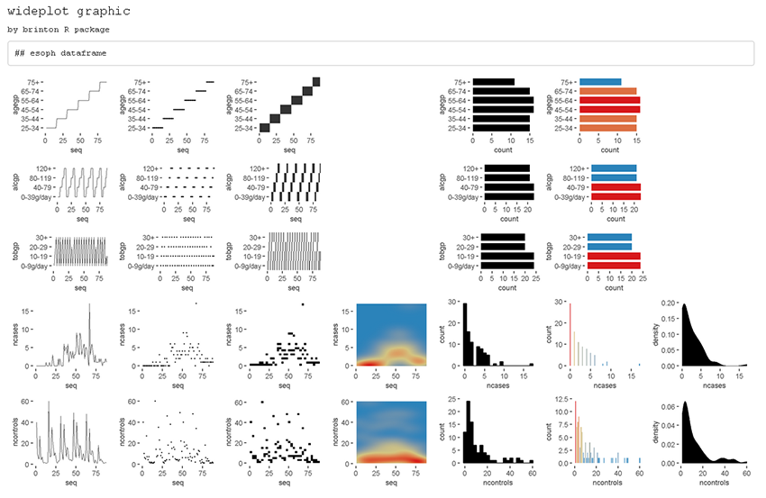
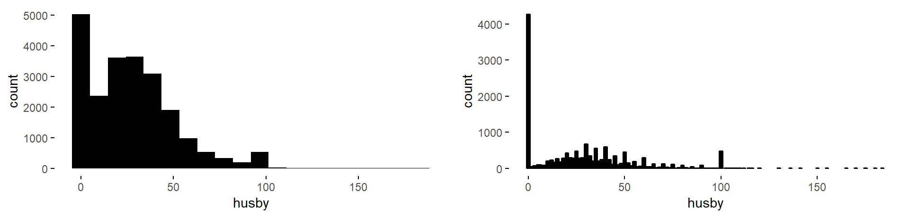

```{r setup, include = FALSE, eval = FALSE}
knitr::opts_chunk$set(
  collapse = TRUE,
  comment = "#>"
)
```

# Introduction

We created `brinton` library to facilitate exploratory data analysis following the visual information-seeking mantra: "Overview first, zoom and filter, then details on demand." The main idea is to assist the user during these three phases through three functions: `wideplot()`, `longplot()` and `plotup()`. While each of these functions has its own arguments and purpose, all three serve to facilitate exploratory data analysis and the selection of a suitable graphic. 

The library can be installed easily from the Comprehensive R Archive Network (CRAN) using the **R** console. When the library is loaded into memory, it provides a startup message that pays homage to Henry D. Hubbard’s enthusiastic introduction to the book Graphic Presentation by Willard Cope Brinton in 1939:

```{r, eval = FALSE}
install.packages('brinton')
library(brinton)
```

```{r, echo = FALSE}
library(brinton)
```

# brinton's functions

The `wideplot()` function allows the user to explore a dataset as a whole using a grid of graphics in which each variable is represented through multiple graphics. Once we have explored the dataset as a whole, the `longplot()` allows us to explore other graphics for a given variable. This function also presents a grid of graphics, but instead of showing a selection of graphics for each variable, it presents the full array of graphics available in the library to represent a single variable. Once we have narrowed in on a certain graphic, we can use the `plotup()` function, which presents the values of a variable on a single graphic. We can access the code of the resulting graph and adapt it as needed. These three functions expand the graphic types that are presented automatically by the autoGEDA libraries in the **R** environment. 

## The wideplot function

The `wideplot()` function returns a graphical summary of the variables included in the dataset to which it has been applied. First it groups the variables according to the following sequence: `logical`, `ordered`, `factor`, `character`, `datetime`, `numeric`. Next, it creates a multipanel graphic in **html** format, in which each variable of the dataset is represented in a row of the grid, while each column displays the different graphics possible for each variable. We called the resulting graphic type wideplot because it shows an array of graphics for all of the columns of the dataset. The structure of the function, the arguments it permits and its default values are as follows:

```{r, echo=FALSE, comment=""}
cat("wideplot(data, dataclass = NULL, logical = NULL, ordered = NULL,
  factor = NULL, character = NULL, datetime = NULL, numeric = NULL,
  group = NULL, ncol = 7, label = 'FALSE')")
```

The only argument necessary to obtain a result is `data` that expects a `data-frame` class object; `ncol` filters the first *n* columns of the grid, between 3 and 7, which will be shown. The fewer columns displayed, the larger the size of the resulting graphics, a feature that is especially useful if the scale labels dwarf the graphics area; `label` adds to the grid a vector below each group of rows according to the variable type, with the names and order of the graphics; `logical`, `ordered`, `factor`, `character`, `datetime` and `numeric` make it possible to choose which graphics appear in the grid and in what order, for each variable type. Finally, `group` changes the selection of graphics that are shown by default according to the criteria of the table 1.

The `wideplot()` function takes inspiration from this function, but instead of describing the dataset in textual or tabular form, it does it graphically. We can easily compare the results of these two functions, for example, with the dataset esoph from a case-control study of esophageal cancer in Ille-et-Vilaine, France. The dataset has three ordered factor-type variables and two numerical variables:

```{r, size="small"}
str(esoph)
```

```{r, eval = FALSE}
wideplot(data = esoph)
```

```{r wideplotesoph, echo=FALSE, out.width = '80%', fig.cap="Figure 1"}

```

If the order and graphic types to be shown for each variable type are not specified and if the graphic types aren’t filtered using the argument `group`, then the default graphic will contain an opinion-based selection graphics for each variable type, organized especially to facilitate comparison between graphics of the same row and between graphics of the same column. The user can overwrite this default selection of graphics as needed, using the arguments `logical`, `ordered`, `factor`, `character`, `datetime` and `numeric`.

```{r table1, echo=FALSE, tab.cap="Table 1"}
table1 <- data.frame("group" = c("sequence", "scatter", "bin", "model", "symbol", "GOF", "random"),
           "graphic type" = c("includes the sequence in which the values are observed so that an axis develops this sequence. e.g., line graph, point-to-point graph", "marks represent individual observations. e.g., point graph, stripe graph", "marks represent aggregated observations based on class intervals. e.g., histogram, bar graph", "represents models based on observations. e.g. density plot, violin plot", "represents models based on observations and not only points, lines or areas. e.g., box plo. ", "represents the goodness of fit of some values with respect to a model. e.g. qq plot", "chosen at random"))
knitr::kable(table1)
```

## The longplot function

To facilitate economy of calculation, the `wideplot()` function presents a limited number of graphics in each row. If the user wants to expand the array of suggested graphics for a given variable, he or she should use the `longplot()` function, which returns a grid with all of the graphics considered by the library for that variable. The structure of the function is very simple `longplot(data, vars, label = TRUE)` and we can easily check the outcome of applying this function to the variable `alcgp` of the dataset `esoph`:

```{r, eval=FALSE}
longplot(esoph, 'alcgp')
```

```{r longplotesophagegp, echo=FALSE, out.width = '80%', fig.cap="Figure 2"}
knitr::include_graphics("figures/longplot_esoph_alcgp.png")
```

The arguments of the function are `data`, which must be a `data-frame` class object; `vars`, which requires the name of a specific variable of the dataset; and `label`, which does not have to be defined and which adds a vector below each row of the grid indicating the name of each graphic. Unlike the grid of the `wideplot()` function, the grid of the `longplot()` function does not include parameters to limit the array of graphics to be presented. We made this decision because the main advantage of this function is precisely that it presents all of the graphic representations available for a given variable. However, we do not rule out adding filters that limit the number of graphics to be shown if this feature seems useful as the catalog fills with graphics. Each graphic presented can be called explicitly by name using the functions `wideplot()` and `plotup()`, which is why the argument `label` has been set to `TRUE` in this case.

The array of graphics that the `longplot()` function returns is sorted so that in the rows we find different graphic types and in the columns different variations of the same graphic type. This organization, however, is not absolute and in some cases in order to compress the results, we find different graphic types in the columns of the same row.

## The plotup function

The `plotup()` function has the following structure: `plotup(data, vars, diagram, output = 'html')`. By default, this function returns an **html** document with a single graphic based on a variable from a given dataset and the name of the desired graphic, from among the names included by the specimen that we present in the next subsection. We can easily check the outcome of applying this function to produce a line graph from the variable `ncases` of the dataset `esoph`:

```{r, eval=FALSE}
plotup(esoph, 'ncases', 'line graph')
```

```{r plotupesophncaseslinegraph, echo=FALSE, out.width = '80%', fig.cap="Figure 3"}
knitr::include_graphics('figures/plotup_esoph_ncases_linegraph.png')
```

This function requires three arguments: `data`, `vars` and `diagram`. The fourth argument, `output`, is optional and has the default value of **html**. However, if it is set to `plots pane`, instead of generating a graphic in an **html** page, it generates a graphic in the plots pane of RStudio. If, instead, it is set to ''console´´, the function returns the code used by the library to generate this precise graphic. This feature is especially useful to adapt the default graphic to the specific needs and preferences of the user.

```{r, comment = ""}
plotup(esoph, 'ncases', 'line graph', output = 'console')
```

# The specimen

The documentation of the library includes the vignette '1v specimen´´, which contains a specimen with images of all the graphic types for a single variable, incorporated into the library according to the variable type. These graphs serve as an example so that the user can rapidly check whether a graphic has been incorporated, the type or types of variable for which it has been incorporated, and the label with which it has been identified. The suitability of a particular graphic will depend on the datasets of interest and the variables of each particular user. 

# Applications

The main application of a library for exploratory data analysis is to help the user make sense of the data. This includes describing the number and nature of the variables, the number of observations and examples of the variables--this is precisely what the `str()` function does. It also includes evaluating the validity and quality of the data and the properties of the values found. Below we list a series of tasks for which the functions included in `brinton` are useful, and describe the process for carrying them out.

## Identify multi-column sorting

Here we describe how to use the `wideplot()` function to determine whether the observations of the dataset `aids` of the library `KMsurv` are sorted according to one of the variables. This dataset has three variables, `infect` (infection time for AIDS in years), `induct` (induction time for AIDS in years), and `adult` (indicator of adult: 1=adult, 0=child). To accomplish the task, we first install the library, then load it into memory and run the wideplot function with its default output.

```{r, eval=FALSE}
data(aids, package = 'KMsurv')
wideplot(aids)
wideplot(aids, numeric = c('line graph', 'stepped line graph'), ncol=5)
```

```{r wideplotaids1, echo=FALSE, out.width = '80%', fig.cap="Figure 4"}
knitr::include_graphics('figures/wideplot_aids0.png')
```

From this result we observe that the line graph is the one that best shows that the dataset is ordered first by the variable `adult` and then by the variable `infect`. To finish selecting the most suitable graphic we can then execute the same function but limit the graphic types such that only two variations of line graph are shown. We can moreover limit the function so that it displays, for example, only five columns, so that the graphics will be larger.

```{r, eval = FALSE}
wideplot(data = aids, numeric = c('line graph', 'stepped line graph'), 
         ncol = 5)
```

```{r wideplotaids2, echo=FALSE, out.width = '80%', fig.cap="Figure 4"}
knitr::include_graphics('figures/wideplot_aids.png')
```

The result is two variations of the line graph for each variable, in which we can clearly see that the data set is ordered first by the variable `adult` and then by the variable `infect`. In this case, there may be equally valid arguments for using the graphics of the first column as the graphics of the second column.

## Identify variables that can be reclassified

When loading a dataset it is important to check which assumptions the function has made and which variables can be reclassified. We can see an example of this in Figure 4, which shows that the variable `adult` of the dataset `aids` is better treated as a `logical`-type variable than an `integer`. If we recode the variable type more appropriately, when we apply the `wideplot()` function again, the graphics it shows also tend to be more appropriate. In Figure 5 we see the result after the variable `adult` is reclassified.

```{r, eval=FALSE}
aids$adult <- as.logical(aids$adult)
wideplot(data = aids)
```

```{r wideplotaids3, echo=FALSE, out.width = '80%', fig.cap="Figure 5"}
knitr::include_graphics('figures/wideplot_aids2.png')
```

## Identify key variables

The best way to identify key variables is by using complementary graphics. Figure 6 makes it possible, for example, to identify rapidly the variable `patient` of the dataset `azt` in the library `KMsurv`, as a key variable, given that it assigns a sequential number to each record, each of which is observed a single time. We can draw these two conclusions from the line graph and the color bar graph. 

```{r, eval=FALSE}
data(azt, package = 'KMsurv')
wideplot(data = azt, label = TRUE)
```

```{r wideplotazt, echo=FALSE, out.width = '80%', fig.cap="Figure 6"}
knitr::include_graphics('figures/wideplot_azt.png')
```

In the case of categorical key variables, the same line graph and color bar graph would also help us to identify the key variable. Figure 7 shows these two graphs for the factor-type variable of the dataset `SpeciesArea` in the library `Stat2Data`, which allow us to identify rapidly the variable `Name` as a key variable.

```{r, echo=TRUE, eval=FALSE}
data(SpeciesArea, package = 'Stat2Data')
wideplot(data = SpeciesArea, dataclas = c('factor'),
         factor = c('line graph', 'color bar graph'), ncol = 5)
```

```{r SpeciesArea, echo=FALSE, out.width = '80%', fig.cap="Figure 7"}
knitr::include_graphics('figures/wideplot_SpeciesArea.png')
```

## Be surprised by serendipity

Next we describe isolated cases in which we are surprised by the values that the data depict. We use the following procedure to locate unexpected aspects of the data: first we obtain a general view of the dataset using the function `wideplot()`; next we focus our attention on one variable in particular and explore all of the compatible graphics using the function `longplot()`; finally, we use the function `plotup()` to obtain the graphic that best enables us to identify, narrow down and communicate the aspect of the data that we have found.

+ The first example of an unexpected funding appears in the variable `experience` (years of potential work experience) of the dataset `HI` in the library `Ecdat`. This dataset contains 22,272 records of 13 variables that link health insurance policies to the weekly hours worked by the wives of the policyholders, while the variable `experience` refers to the years of potential work experience of the wives. If we look at the bar graph applied to this numerical variable --see Figure 8--, we see that the frequency of the whole values is systematically greater than the frequency of the real non-whole values. This behavior could indicate that the variable can be informed with excessive precision and whoever informed the variable `experience` tended to round to the unit. Another possibility is that the dataset was constructed by joining two data sources with different degrees of precision.

```{r, eval = FALSE, echo = TRUE}
data(HI, package = 'Ecdat')
wideplot(data = HI)
longplot(data = HI, vars = 'experience')
plotup(data = HI, vars = 'experience', diagram = 'bar graph', 
       output = 'plots pane')
```

```{r HI_1, fig.height=2.4, out.width = '40%', echo = FALSE, fig.cap="Figure 8"}
knitr::include_graphics('figures/HI_1-1.png')
```

+ In the same dataset we can see that we could reach mistaken conclusions about the distribution of the variable `husby` (husband’s income in thousands of dollars) if we only looked at a histogram. As we can see in Figure 9, the distribution, and in particular the value zero, acquires a different value if we compare the histogram (right) with another graphic that isn’t as common for numerical variables: the bar graph (left), which shows the count of unique values. The bar graph makes it possible to clearly differentiate two groups: the informants whose husbands have no income and the informants whose husbands do have income (and to whom, therefore, it makes more sense to ask approximate income).

```{r HI_11, eval = FALSE, echo=TRUE}
gridExtra::grid.arrange(plotup(HI, 'husby', 'histogram', output = 'plots pane'),
                        plotup(HI, 'husby', 'bar graph', output = 'plots pane'),
                        heights=grid::unit(c(2.4), c('in')),
                        ncol=2)
```

```{r HI_2, echo=FALSE, fig.width=10, fig.height = 2.4, out.width = '80%', fig.cap="Figure 9"}

```


