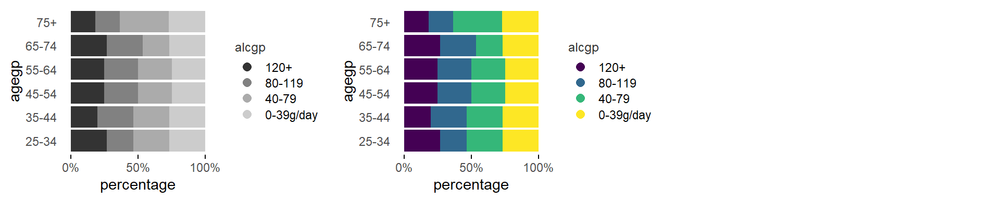
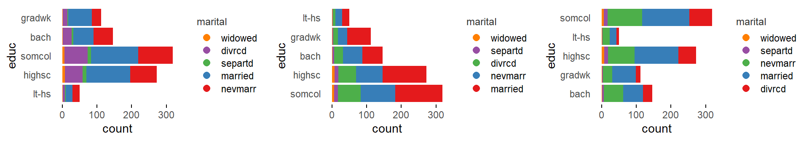
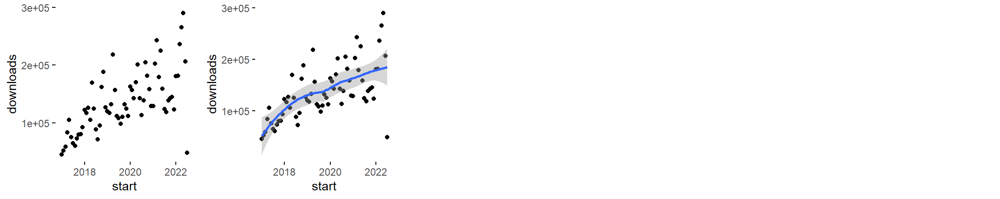
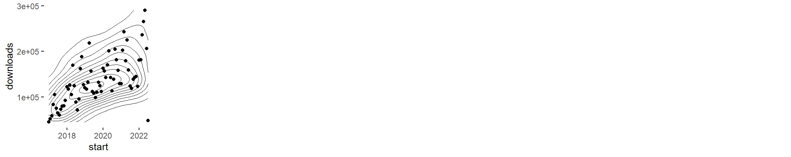
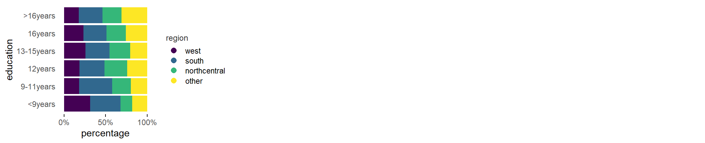

<style>
  .main-container {
  max-width: 1200px !important;
  }
  h1.title {
  font-family: Helvetica, Arial, sans-serif;
  font-size: 20px;
  color: #4d4d4d;
  margin-top: 100px;
  }
  h1 {
  font-family: Helvetica, Arial, sans-serif;
  font-size: 20px;
  color: 4d4d4d;
  margin-top: 35px;
  }
  h2 {
  font-family: Helvetica, Arial, sans-serif;
  font-size: 16px;
  color: #4d4d4d;
  margin-top: 25px;
  font-weight: bold;
  }
  h3 {
  font-family: Helvetica, Arial, sans-serif;
  font-size: 14px;
  color: #4d4d4d;
  margin-top: 15px;
  font-weight: bold;
  }
  h4 {
  font-family: Helvetica, Arial, sans-serif;
  font-size: 14px;
  color: #4d4d4d;
  margin-top: 10px;
  font-style: oblique;
  }
  h4.author {
  font-family: Helvetica, Arial, sans-serif;
  font-size: 10pt;
  margin-top: 0px;
  }
  h4.date {
  font-family: Helvetica, Arial, sans-serif;
  font-size: 10pt;
  margin-top: 0px;
  }
</style>

Specimen of the graphics that require 2 input variables and that, up to now, are being considered by the brinton's `longplot()` and `brinton::plotup()` functions.

```{r, echo=FALSE, message=FALSE, warning=FALSE, comment=FALSE}
knitr::opts_chunk$set(
  message=FALSE, 
  warning=FALSE, 
  comment=NA, 
  dev='png', 
  echo=FALSE
  )

# length(unique(data$vars))/6 + 0.5
```

```{r, echo=FALSE, message=FALSE}
# library(dplyr)
```

# 2 Numeric

```{r 2numeric_01, fig.width=12, fig.height=2.4}
knitr::include_graphics('figures/2numeric_01-1.png')
cat("2num = c('scatter plot', 'bw scatter plot', 'color scatter plot')")
```

```{r 2numeric_03, fig.width=12, fig.height=2.4}
knitr::include_graphics('figures/2numeric_03-1.png')
cat("2num = c('binned scatter plot', 'bw binned scatter plot', 'color binned scatter plot')")
```

```{r 2numeric_04, fig.width=12, fig.height=2.4}
knitr::include_graphics('figures/2numeric_04-1.png')
cat("2num = c('binned heatmap', 'bw binned heatmap', 'color binned heatmap')")
```

```{r 2numeric_05, fig.width=12, fig.height=2.4}
knitr::include_graphics('figures/2numeric_05-1.png')
cat("2num = c('hexagonal binned heatmap', 'bw hexagonal binned heatmap', 'color hexagonal binned heatmap')")
```

```{r 2numeric_06, fig.width=12, fig.height=2.4}
knitr::include_graphics('figures/2numeric_06-1.png')
cat("2num = c('blank', 'bw heatmap', 'color heatmap')")
```

```{r 2numeric_07, fig.width=12, fig.height=2.4}
knitr::include_graphics('figures/2numeric_07-1.png')
cat("2num = c('contour plot', 'bw contour plot', 'color contour plot')")
```

```{r 2numeric_08, fig.width=12, fig.height=2.4}
knitr::include_graphics('figures/2numeric_08-1.png')
cat("2num = c('contour plot with data points', 'bw contour plot with data points', 'color contour plot with data points')")
```

```{r 2numeric_09, fig.width=12, fig.height=2.4}
knitr::include_graphics('figures/2numeric_09-1.png')
cat("2num = c('parallel plot', 'bw parallel plot', 'color parallel plot')")
```

```{r 2numeric_10, fig.width=12, fig.height=2.4}
knitr::include_graphics('figures/2numeric_10-1.png')
cat("2num = c('unscaled parallel plot', 'unscaled bw parallel plot', 'unscaled color parallel plot')")
```

```{r 2numeric_11, fig.width=12, fig.height=2.4}
knitr::include_graphics('figures/2numeric_11-1.png')
cat("2num = c('path graph', 'bw path graph', 'color path graph')")
```

```{r 2numeric_12, fig.width=12, fig.height=2.4}
knitr::include_graphics('figures/2numeric_12-1.png')
cat("2num = c('point-to-point graph', 'bw point-to-point graph', 'color point-to-point graph')")
```

```{r 2numeric_13, fig.width=12, fig.height=2.4}
knitr::include_graphics('figures/2numeric_13-1.png')
cat("2num = c('point graph', 'bw point graph', 'color point graph')")
```

```{r 2numeric_14, fig.width=12, fig.height=2.4}
knitr::include_graphics('figures/2numeric_14-1.png')
cat("2num = c('line graph', 'stepped line graph')")
```

```{r 2numeric_15, fig.width=12, fig.height=2.4}
knitr::include_graphics('figures/2numeric_15-1.png')
cat("2num = c('area graph')")
```

```{r 2numeric_16, fig.width=12, fig.height=2.4}
knitr::include_graphics('figures/2numeric_16-1.png')
cat("2num = c('stepped area graph', 'bw stepped area graph', 'color stepped area graph')")
```

```{r 2numeric_17, fig.width=12, fig.height=2.4}
knitr::include_graphics('figures/2numeric_17-1.png')
cat("2num = c('blank', 'bw heatmap', 'color heatmap')")
```

```{r 2numeric_18, fig.width=12, fig.height=2.4}
knitr::include_graphics('figures/2numeric_18-1.png')
cat("2num = c('blank', 'bw seq. stripe graph', 'color seq. stripe graph')")
```

```{r 2numeric_19, fig.width=12, fig.height=2.4}
knitr::include_graphics('figures/2numeric_19-1.png')
cat("2num = c('histogram', 'bw histogram', 'color histogram')")
```

```{r 2numeric_20, fig.width=12, fig.height=2.4}
knitr::include_graphics('figures/2numeric_20-1.png')
cat("2num = c('freq. polygon'))")
```

```{r 2numeric_21, fig.width=12, fig.height=2.4}
knitr::include_graphics('figures/2numeric_21-1.png')
cat("2num = c('density plot', 'filled density plot')")
```

```{r 2numeric_22, fig.width=12, fig.height=2.4}
knitr::include_graphics('figures/2numeric_22-1.png')
cat("2num = c('violin plot', 'filled violin plot')")
```

```{r 2numeric_23, fig.width=12, fig.height=2.4}
knitr::include_graphics('figures/2numeric_23-1.png') 
cat("2num = c('box plot'))")
```

```{r 2numeric_24, fig.width=12, fig.height=2.4}
knitr::include_graphics('figures/2numeric_24-1.png')
cat("2num = c('ecdf plot', 'point ecdf plot', 'stepped ecdf plot')")
```

# 2 Datetime

```{r 2datetime_01, fig.width=12, fig.height=2.4}
knitr::include_graphics('figures/2datetime_01-1.png')
cat("2dtt = c('scatter plot', 'scatter plot with trend line')")
```

```{r 2datetime_02, fig.width=12, fig.height=2.4}
knitr::include_graphics('figures/2datetime_02-1.png')
cat("2dtt = c('binned scatter plot', 'bw binned scatter plot', 'color binned scatter plot')")
```

```{r 2datetime_03, fig.width=12, fig.height=2.4}
knitr::include_graphics('figures/2datetime_03-1.png')
cat("2dtt = c('blank', 'bw heatmap', 'color heatmap')")
```

```{r 2datetime_04, fig.width=12, fig.height=2.4}
knitr::include_graphics('figures/2datetime_04-1.png')
cat("2dtt = c('contour plot with data points')")
```

```{r 2datetime_05, fig.width=12, fig.height=2.4}
knitr::include_graphics('figures/2datetime_05-1.png')
cat("2dtt = c('path graph', 'bw path graph', 'color path graph')")
```

```{r 2datetime_06, fig.width=12, fig.height=2.4}
knitr::include_graphics('figures/2datetime_06-1.png')
cat("2dtt = c('point-to-point graph', 'bw point-to-point graph', 'color point-to-point graph')")
```

# 2 Ordered

```{r 2ordered_01, fig.width=10, fig.height=1.5}
knitr::include_graphics('figures/2ordered_01-1.png')
cat("2ord = c('bw stacked bar graph', 'color stacked bar graph')")
```

```{r 2ordered_02, fig.width=10, fig.height=2}
knitr::include_graphics('figures/2ordered_02-1.png')
cat("2ord = c('transposed bw stacked bar graph', 'transposed color stacked bar graph')")
```

```{r 2ordered_03, fig.width=10, fig.height=1.5}
knitr::include_graphics('figures/2ordered_03-1.png')
cat("2ord = c('bw 100% stacked bar graph', 'color 100% stacked bar graph')")
```

```{r 2ordered_04, fig.width=10, fig.height=2}

cat("2ord = c('transposed bw 100% stacked bar graph', 'transposed color 100% stacked bar graph')")
```

```{r 2ordered_05, fig.width=10, fig.height=2}
knitr::include_graphics('figures/2ordered_05-1.png')
cat("2ord = c('bw heatmap', 'color heatmap')")
```

```{r 2ordered_06, fig.width=10, fig.height=2}
knitr::include_graphics('figures/2ordered_06-1.png')
cat("2ord = c('bw stacked bar graph', 'color stacked bar graph')")
```

```{r 2ordered_07, fig.width=10, fig.height=2}
knitr::include_graphics('figures/2ordered_07-1.png')
cat("2ord = c('bw stacked bar graph', 'color stacked bar graph')")
```

```{r 2ordered_08, fig.width=10, fig.height=2}
knitr::include_graphics('figures/2ordered_08-1.png')
cat("2ord = c('bw stacked bar graph', 'color stacked bar graph')")
```

```{r 2ordered_09, fig.width=10, fig.height=2}
knitr::include_graphics('figures/2ordered_09-1.png')
cat("2ord = c('bw stacked bar graph', 'color stacked bar graph')")
```

# 2 Factor

```{r 2factor_01, fig.width=10, fig.height=1.75}
knitr::include_graphics('figures/2factor_01-1.png')
cat("2fac = c('color stacked bar graph', 'color freq. reordered stacked bar graph', 'color alphab. reordered stacked bar graph')")
```
```{r 2factor_02, fig.width=10, fig.height=1.75}

cat("2fac = c('transposed color stacked bar graph', 'transposed color freq. reordered stacked bar graph', 'transposed color alphab. reordered stacked bar graph')")
```

```{r 2factor_03, fig.width=10, fig.height=1.75}
knitr::include_graphics('figures/2factor_03-1.png')
cat("2fac = c('color 100% stacked bar graph', 'color freq. reordered 100% stacked bar graph', 'color alphab. reordered 100% stacked bar graph')")
```

```{r 2factor_04, fig.width=10, fig.height=1.75}
knitr::include_graphics('figures/2factor_04-1.png')
cat("2fac = c('transposed color 100% stacked bar graph', 'transposed color freq. reordered 100% stacked bar graph', 'transposed color alphab. reordered 100% stacked bar graph')")
```
```{r 2factor_05, fig.width=9, fig.height=2.1}
knitr::include_graphics('figures/2factor_05-1.png')
cat("2fac = c('bw heatmap', 'bw freq. reordered heatmap', 'bw alphab. reordered heatmap')")
```

```{r 2factor_06, fig.width=9, fig.height=2.1}
knitr::include_graphics('figures/2factor_06-1.png')
cat("2fac = c('color heatmap', 'color freq. reordered heatmap', 'color alphab. reordered heatmap')")
```

```{r 2factor_07, fig.width=9, fig.height=2.1}
knitr::include_graphics('figures/2factor_07-1.png')
cat("2fac = c('color residuals heatmap', 'color freq. reordered residuals heatmap', 'color alphab. reordered residuals heatmap')")
```

```{r 2factor_08, fig.width=9, fig.height=2.1}
knitr::include_graphics('figures/2factor_08-1.png')
cat("2fac = c('bw contribution to x2 heatmap', 'bw freq. reordered contribution to x2 heatmap', 'bw alphab. reordered contribution to x2 heatmap')")
```

```{r 2factor_09, fig.width=9, fig.height=2.1}
knitr::include_graphics('figures/2factor_09-1.png')
cat("2fac = c('bw contribution to x2 heatmap', 'bw freq. reordered contribution to x2 heatmap', 'bw alphab. reordered contribution to x2 heatmap')")
```

```{r 2factor_10, fig.width=9, fig.height=2.1}
knitr::include_graphics('figures/2factor_10-1.png')
cat("2fac = c('bw balloon plot', 'bw freq. reordered balloon plot', 'bw alphab. reordered balloon plot')")
```

```{r 2factor_11, fig.width=9, fig.height=2.1}
knitr::include_graphics('figures/2factor_11-1.png')
cat("2fac = c('color balloon plot', 'color freq. reordered balloon plot', 'color alphab. reordered balloon plot')")
```

```{r 2factor_12, fig.width=9, fig.height=2.1}
knitr::include_graphics('figures/2factor_12-1.png')
cat("2fac = c('color residuals balloon plot', 'color freq. reordered residuals balloon plot', 'color alphab. reordered residuals balloon plot')")
```

```{r 2factor_13, fig.width=9, fig.height=2.1}
knitr::include_graphics('figures/2factor_13-1.png')
cat("2fac = c('bw contribution to x2 balloon plot', 'bw freq. reordered contribution to x2 balloon plot', 'bw alphab. reordered contribution to x2 balloon plot')")
```

```{r 2factor_14, fig.width=9, fig.height=2.1}
knitr::include_graphics('figures/2factor_14-1.png')
cat("2fac = c('bw contribution to x2 balloon plot', 'bw freq. reordered contribution to x2 balloon plot', 'bw alphab. reordered contribution to x2 balloon plot')")
```

# Numeric ~ Datetime

```{r date-num_01, fig.width=12, fig.height=2.4}

cat("num~dtt = c('scatter plot', 'scatter plot with trend line')")
```

```{r date-num_02, fig.width=12, fig.height=2.4}
knitr::include_graphics('figures/date-num_02-1.png')
cat("num~dtt = c('binned scatter plot', 'bw binned scatter plot', 'color binned scatter plot')")
```

```{r date-num_03, fig.width=12, fig.height=2.4}
knitr::include_graphics('figures/date-num_03-1.png')
cat("num~dtt = c('blank', 'bw heatmap', 'color heatmap')")
```

```{r date-num_04, fig.width=12, fig.height=2.4}

cat("num~dtt = c('contour plot with data points')")
```

```{r date-num_05, fig.width=12, fig.height=2.4}
knitr::include_graphics('figures/date-num_05-1.png')
cat("num~dtt = c('path graph', 'bw path graph', 'color path graph')")
```

```{r date-num_06, fig.width=12, fig.height=2.4}
knitr::include_graphics('figures/date-num_06-1.png')
cat("num~dtt = c('point-to-point graph', 'bw point-to-point graph', 'color point-to-point graph')")
```

# Numeric ~ Ordered

```{r num-ord_01, fig.width=12, fig.height=1}
knitr::include_graphics('figures/num-ord_01-1.png')
cat("num~ord = c('path graph')")
```

```{r num-ord_02, fig.width=12, fig.height=1}
knitr::include_graphics('figures/num-ord_02-1.png')
cat("num~ord = c('point graph')")
```

```{r num-ord_03, fig.width=12, fig.height=1}
knitr::include_graphics('figures/num-ord_03-1.png')
cat("num~ord = c('tile plot')")
```

```{r num-ord_04, fig.width=12, fig.height=1}
knitr::include_graphics('figures/num-ord_04-1.png')
cat("num~ord = c('binned heatmap')")
```

```{r num-ord_05, fig.width=12, fig.height=1}
knitr::include_graphics('figures/num-ord_05-1.png')
cat("num~ord = c('bw binned heatmap')")
```

```{r num-ord_06, fig.width=12, fig.height=1}
knitr::include_graphics('figures/num-ord_06-1.png')
cat("num~ord = c('color binned heatmap')")
```

```{r num-ord_07, fig.width=12, fig.height=1}
knitr::include_graphics('figures/num-ord_07-1.png')
cat("num~ord = c('violin plot')")
```

```{r num-ord_08, fig.width=12, fig.height=1}
knitr::include_graphics('figures/num-ord_08-1.png')
cat("num~ord = c('filled violin plot')")
```

```{r num-ord_09, fig.width=12, fig.height=1}
knitr::include_graphics('figures/num-ord_09-1.png')
cat("num~ord = c('box plot')")
```

```{r num-ord_10, fig.width=12, fig.height=2.4}
knitr::include_graphics('figures/num-ord_10-1.png')
cat("num~ord = c('blank', 'bw stacked histogram', 'color stacked histogram')")
```

```{r num-ord_11, fig.width=12, fig.height=2.4}

cat("num~ord = c('blank', 'bw 100% stacked histogram', 'color 100% stacked histogram')")
```

```{r num-ord_12, fig.width=12, fig.height=2.4}
knitr::include_graphics('figures/num-ord_12-1.png')
cat("num~ord = c('density plot', 'bw density plot', 'color density plot')")
```

```{r num-ord_13, fig.width=12, fig.height=2.4}
knitr::include_graphics('figures/num-ord_13-1.png')
cat("num~ord = c('blank', 'bw filled density plot', 'color filled density plot')")
```

# Numeric ~ Factor

```{r fac-num_01, fig.width=12, fig.height=1}
knitr::include_graphics('figures/fac-num_01-1.png')
cat("num~fac = c('path graph', 'freq. reordered path graph', 'alphab. reordered path graph')")
```

```{r fac-num_02, fig.width=12, fig.height=1}
knitr::include_graphics('figures/fac-num_02-1.png')
cat("num~fac = c('point graph', 'freq. reordered point graph', 'alphab. reordered point graph')")
```

```{r fac-num_03, fig.width=12, fig.height=1}
knitr::include_graphics('figures/fac-num_03-1.png')
cat("num~fac = c('tile plot', 'freq. reordered tile plot', 'alphab. reordered tile plot')")
```

```{r fac-num_04, fig.width=12, fig.height=1}
knitr::include_graphics('figures/fac-num_04-1.png')
cat("num~fac = c('binned heatmap', 'freq. reordered binned heatmap', 'alphab. reordered binned heatmap')")
```

```{r fac-num_05, fig.width=12, fig.height=1}
knitr::include_graphics('figures/fac-num_05-1.png')
cat("num~fac = c('bw binned heatmap', 'bw freq. reordered binned heatmap', 'bw alphab. reordered binned heatmap')")
```

```{r fac-num_06, fig.width=12, fig.height=1}
knitr::include_graphics('figures/fac-num_06-1.png')
cat("num~fac = c('color binned heatmap', 'color freq. reordered binned heatmap', 'color alphab. reordered binned heatmap')")
```

```{r fac-num_07, fig.width=12, fig.height=1}
knitr::include_graphics('figures/fac-num_07-1.png')
cat("num~fac = c('violin plot', 'freq. reordered violin plot', 'alphab. reordered violin plot')")
```

```{r fac-num_08, fig.width=12, fig.height=1}
knitr::include_graphics('figures/fac-num_08-1.png')
cat("num~fac = c('filled violin plot', 'freq. reordered filled violin plot', 'alphab. reordered filled violin plot')")
```

```{r fac-num_09, fig.width=12, fig.height=1}
knitr::include_graphics('figures/fac-num_09-1.png')
cat("num~fac = c('box plot', 'freq. reordered box plot', 'alphab. reordered box plot')")
```

```{r fac-num_10, fig.width=12, fig.height=2.4}

cat("num~fac = c('blank', 'bw stacked histogram', 'color stacked histogram')")
```

```{r fac-num_11, fig.width=12, fig.height=2.4}

cat("num~fac = c('blank', 'bw 100% stacked histogram', 'color 100% stacked histogram')")
```

```{r fac-num_12, fig.width=12, fig.height=2.4}
knitr::include_graphics('figures/fac-num_12-1.png')
cat("num~fac = c('density plot', 'blank', 'color density plot')")
```

```{r fac-num_13, fig.width=12, fig.height=2.4}
knitr::include_graphics('figures/fac-num_13-1.png')
cat("num~fac = c('blank', 'filled density plot', 'color filled density plot')")
```

# Factor ~ Ordered

```{r fac-ord_01, fig.width=11, fig.height=1.75}
knitr::include_graphics('figures/fac-ord_01-1.png')
cat("fac~ord = c('color stacked bar graph', 'color freq. reordered stacked bar graph', 'color alphab. reordered stacked bar graph')")
```

```{r fac-ord_02, fig.width=11, fig.height=1.75}
knitr::include_graphics('figures/fac-ord_02-1.png')
cat("fac~ord = c('color stacked bar graph', 'color freq. reordered stacked bar graph', 'color alphab. reordered stacked bar graph')")
```

```{r fac-ord_03, fig.width=11, fig.height=2.25}
knitr::include_graphics('figures/fac-ord_03-1.png')
cat("fac~ord = c('transposed color stacked bar graph')")
```

```{r fac-ord_04, fig.width=11, fig.height=1.75}
knitr::include_graphics('figures/fac-ord_04-1.png')
cat("fac~ord = c('color 100% stacked bar graph', 'color freq. reordered 100% stacked bar graph', 'color alphab. reordered 100% stacked bar graph')")
```


```{r fac-ord_05, fig.width=11, fig.height=2.25}

cat("fac~ord = c('transposed color 100% stacked bar graph')")
```


```{r fac-ord_06, fig.width=10, fig.height=2.3}
knitr::include_graphics('figures/fac-ord_06-1.png')
cat("fac~ord = c('bw heatmap', 'bw freq. reordered heatmap', 'bw alphab. reordered heatmap')")
```

```{r fac-ord_07, fig.width=10, fig.height=2.3}
knitr::include_graphics('figures/fac-ord_07-1.png')
cat("fac~ord = c('color heatmap', 'color freq. reordered heatmap', 'color alphab. reordered heatmap')")
```

```{r fac-ord_08, fig.width=10, fig.height=2.3}
knitr::include_graphics('figures/fac-ord_08-1.png')
cat("fac~ord = c('color residuals heatmap', 'color freq. reordered residuals heatmap', 'color alphab. reordered residuals heatmap')")
```

```{r fac-ord_09, fig.width=10, fig.height=2.3}
knitr::include_graphics('figures/fac-ord_09-1.png')
cat("fac~ord = c('bw contribution to x2 heatmap', 'bw freq. reordered contribution to x2 heatmap', 'bw alphab. reordered contribution to x2 heatmap')")
```

```{r fac-ord_10, fig.width=10, fig.height=2.3}
knitr::include_graphics('figures/fac-ord_10-1.png')
cat("fac~ord = c('bw contribution to x2 heatmap', 'bw freq. reordered contribution to x2 heatmap', 'bw alphab. reordered contribution to x2 heatmap')")
```

```{r fac-ord_11, fig.width=10, fig.height=2.3}
knitr::include_graphics('figures/fac-ord_11-1.png')
cat("fac~ord = c('bw balloon plot', 'bw freq. reordered balloon plot', 'bw alphab. reordered balloon plot')")
```

```{r fac-ord_12, fig.width=10, fig.height=2.3}
knitr::include_graphics('figures/fac-ord_12-1.png')
cat("fac~ord = c('color balloon plot', 'color freq. reordered balloon plot', 'color alphab. reordered balloon plot')")
```

```{r fac-ord_13, fig.width=10, fig.height=2.3}
knitr::include_graphics('figures/fac-ord_13-1.png')
cat("fac~ord = c('color residuals balloon plot', 'color freq. reordered residuals balloon plot', 'color alphab. reordered residuals balloon plot')")
```

```{r fac-ord_14, fig.width=10, fig.height=2.3}
knitr::include_graphics('figures/fac-ord_14-1.png')
cat("fac~ord = c('bw contribution to x2 balloon plot', 'bw freq. reordered contribution to x2 balloon plot', 'bw alphab. reordered contribution to x2 balloon plot')")
```

```{r fac-ord_15, fig.width=10, fig.height=2.3}
knitr::include_graphics('figures/fac-ord_15-1.png')
cat("fac~ord = c('bw contribution to x2 balloon plot', 'bw freq. reordered contribution to x2 balloon plot', 'bw alphab. reordered contribution to x2 balloon plot')")
```
